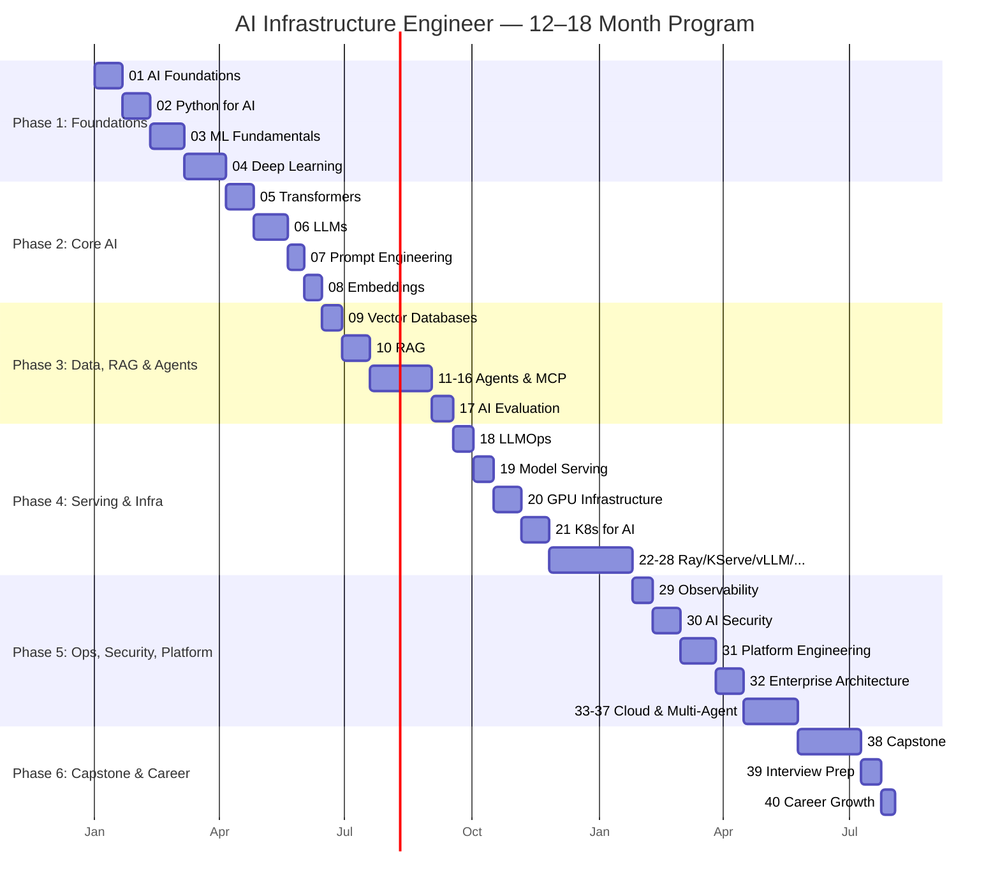

# 00 — Roadmap & Learning Operating System

This is the control center for the entire handbook. Everything about **what to learn, in what order, to what depth, and how it's assessed** lives here.

---

## Documents In This Folder

| Document | Purpose |
|----------|---------|
| [`module-catalog.md`](./module-catalog.md) | Every one of the 40 modules: objective, background, key skills, dependencies, project. |
| [`knowledge-graph.md`](./knowledge-graph.md) | Mermaid dependency graphs: what must be learned first, critical path, optional/advanced/expert paths. |
| [`learning-paths.md`](./learning-paths.md) | Curated routes (Fast Track, Serving Specialist, Platform Architect, Agents Specialist, Full Master). |
| [`difficulty-levels.md`](./difficulty-levels.md) | The six-level ladder from Beginner to Principal Engineer, with per-level expectations. |
| [`assessment-framework.md`](./assessment-framework.md) | How each module is evaluated: exams, interviews, code reviews, incidents. |
| [`progress.md`](./progress.md) | Living build + personal-progress tracker. |
| [`templates/`](./templates/) | Canonical module, lab, project, ADR, and assessment templates. |

---

## The 12–18 Month Plan

This curriculum is designed as a **12–18 month** deep program (≈10–15 hrs/week). It is organized into six phases that map onto the modules.

---

## Phase Overview

| Phase | Modules | Theme | Outcome |
|-------|---------|-------|---------|
| **1. Foundations** | 01–04 | Speak AI/ML fluently; understand tensors, training, DL. | Can read papers and reason about models. |
| **2. Core AI** | 05–08 | Transformers, LLMs, prompting, embeddings. | Understand how modern models work end-to-end. |
| **3. Data, RAG & Agents** | 09–17 | Vector DBs, RAG, agent frameworks, MCP, evaluation. | Build production RAG + multi-agent systems. |
| **4. Serving & Infra** | 18–28 | LLMOps, serving engines, GPUs, K8s, distributed inference. | Serve thousands of RPS on GPU clusters. |
| **5. Ops, Security, Platform** | 29–37 | Observability, security, platform + enterprise architecture, cloud. | Design & operate enterprise AI platforms. |
| **6. Capstone & Career** | 38–40 | Integrate everything; get hired; grow. | Ship a full platform; pass staff-level interviews. |

---

## Ground Rules

1. **Never skip the dependency graph.** If a module lists prerequisites, complete them first.
2. **Do the labs.** Reading is not learning here; the labs and projects are the curriculum.
3. **Assess honestly.** Do not advance until you pass the module's practical exam and design interview.
4. **Keep it running.** Every project must be reproducible from scratch, and every cloud/GPU resource must be torn down.
5. **Improve as you go.** When you learn something new, update earlier modules — this is a living handbook.

---

## Next Step

Read the **[Module Catalog](./module-catalog.md)** → choose a **[Learning Path](./learning-paths.md)** → begin **`/01-ai-foundations`** (built in Phase 2, after approval).
