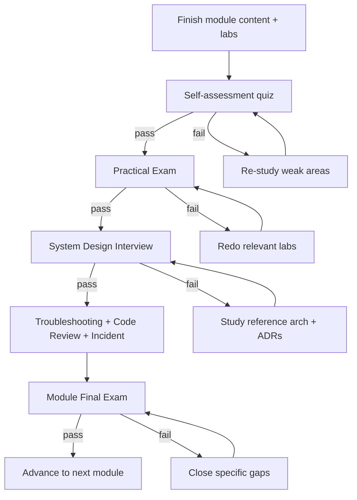

# Assessment Framework

How mastery is measured. Every module ends with the same battery of assessments so progress is objective and interview-realistic.

> Rule: **do not advance** to the next module until you pass its Practical Exam **and** its System-Design Interview.

---

## The Seven Assessment Types

Each module's `assessments/` folder contains all seven:

| # | Assessment | Format | What it proves |
|---|------------|--------|----------------|
| 1 | **Practical Exam** | Hands-on task with graded validation | You can build/operate the thing. |
| 2 | **Architecture Interview** | Whiteboard/system-design prompt + rubric | You can design it at scale. |
| 3 | **Troubleshooting Interview** | A broken system to diagnose | You can debug under pressure. |
| 4 | **Code Review** | A PR with planted issues to critique | You have judgment and standards. |
| 5 | **Scenario Interview** | Open-ended "what would you do if..." | You reason about trade-offs. |
| 6 | **System Design Interview** | Full design doc + defense | Staff/Principal-level thinking. |
| 7 | **Production Incident** | Timed incident simulation + postmortem | You operate calmly and write postmortems. |

Plus lightweight checks: a **self-assessment quiz** and a **final exam** per module.

---

## Scoring Rubric (applies to interviews & exams)

Each dimension scored 1–5; you need an average ≥ 3.5 to pass, with no dimension below 2.

| Dimension | 1 (poor) | 3 (solid) | 5 (staff/principal) |
|-----------|----------|-----------|---------------------|
| **Correctness** | Doesn't work | Works for the happy path | Works, with edge cases handled |
| **Trade-off reasoning** | None | Names trade-offs | Quantifies and defends choices |
| **Scalability** | Single-node thinking | Scales with load | Designs for scale + failure |
| **Security** | Ignored | Basic controls | Threat-modeled, defense-in-depth |
| **Cost** | Ignored | Aware of cost | Optimizes with a cost model |
| **Operability** | No observability | Metrics/logs | SLOs, alerts, runbooks, DR |
| **Communication** | Unclear | Clear | Crisp, leads the room |

---

## Assessment Flow Per Module

---

## Production Incident Simulations

Each module ships at least one incident scenario with this shape (see the [assessment template](./templates/assessment-template.md)):

- **Alert:** what paged you (symptom + metrics).
- **Environment:** the deployed system + access.
- **Timer:** target MTTR.
- **Injected fault:** the actual root cause (hidden until debrief).
- **Deliverable:** mitigation + a written postmortem (impact, timeline, root cause, action items).

Example titles you'll encounter: "vLLM OOM under burst traffic", "RAG answers went stale after re-index", "GPU node NotReady mid-rollout", "prompt-injection data exfiltration in production", "multi-region failover didn't fail over".

---

## Capstone Assessment (Module 38)

The capstone is assessed as a **full design review + live operations exercise**:

1. **Design review board:** present the enterprise platform architecture; defend every ADR.
2. **Load & chaos test:** hit target RPS, then inject failures (node loss, region loss, dependency outage).
3. **Security review:** pass a red-team pass against the AI Security Platform.
4. **Cost review:** present the FinOps model and optimizations.
5. **On-call simulation:** resolve two injected incidents and write postmortems.

Passing the capstone = ready for staff/principal AI-infra interviews (Module 39).

---

## Tracking

Record scores and dates in [`progress.md`](./progress.md). Treat a failed assessment as signal, not failure — it tells you exactly which lab/section to revisit.
