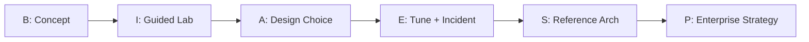

# Difficulty Ladder

Every lesson, lab, and exercise is tagged with one of six levels. Use these to calibrate how deep to go and to know when you're ready for the next role band.

| Tag | Level | You can... |
|-----|-------|-----------|
| `B` | **Beginner** | Follow guided steps; understand definitions and the "what". |
| `I` | **Intermediate** | Apply concepts to a new but similar problem with minimal guidance. |
| `A` | **Advanced** | Design a component, reason about trade-offs, debug non-obvious failures. |
| `E` | **Expert** | Own a subsystem end-to-end; tune for performance/cost; handle production incidents. |
| `S` | **Staff Engineer** | Design cross-cutting systems; set standards; make build-vs-buy calls; mentor. |
| `P` | **Principal Engineer** | Set org-wide technical direction; design multi-region/enterprise platforms; drive strategy. |

---

## Per-Level Expectations

### `B` Beginner
- **Focus:** vocabulary and mental models.
- **Evidence of mastery:** can explain the concept to another engineer in plain language.
- **Example task:** describe the difference between training and inference and where each runs.

### `I` Intermediate
- **Focus:** hands-on application.
- **Evidence:** completes a lab without step-by-step hand-holding.
- **Example task:** deploy a single-GPU model server and hit it with a load test.

### `A` Advanced
- **Focus:** design + debugging + trade-offs.
- **Evidence:** chooses between two approaches and defends the choice; roots out a subtle bug.
- **Example task:** decide between dynamic and continuous batching for a workload and justify it.

### `E` Expert
- **Focus:** ownership, performance, cost, incidents.
- **Evidence:** meets an SLO under load; resolves a simulated production incident.
- **Example task:** tune vLLM to hit a p95 latency + RPS target within a GPU budget.

### `S` Staff Engineer
- **Focus:** systems thinking across teams; standards; leverage.
- **Evidence:** produces a reference architecture + ADRs others can build on.
- **Example task:** design the golden path for self-service model deployment on the platform.

### `P` Principal Engineer
- **Focus:** org-wide direction and strategy.
- **Evidence:** designs a multi-region, DR-capable enterprise platform and its rollout strategy.
- **Example task:** author the enterprise AI platform RFC and lead its design review.

---

## How Difficulty Progresses Within a Module

Each module presents the same topic at escalating depth, so you can stop at your target level or push further:

Labs are marked, e.g. `Lab 24.3 [E]`, and every module's **final exam** includes at least one `S`/`P`-level system-design prompt.

---

## Role-Readiness Checkpoints

| If your target role is... | Consistently operate at... | Key gate modules |
|---------------------------|----------------------------|------------------|
| AI Infra Engineer (mid) | `A` | 19, 20, 21, 24 |
| Senior AI Infra Engineer | `E` | 24, 28, 29, 30 |
| Staff AI Platform Engineer | `S` | 31, 32, 37 |
| Principal AI Architect | `P` | 32, 38 (capstone) |
