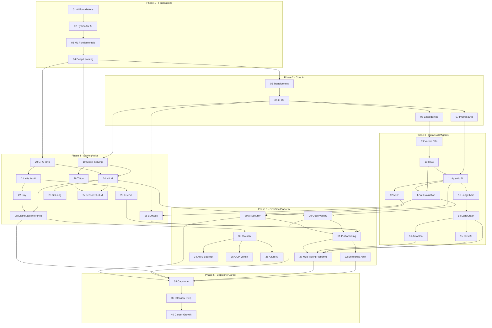
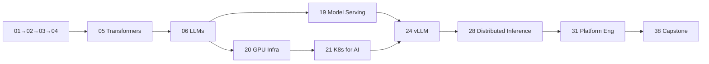

# Knowledge Graph — Dependencies & Critical Path

This is the dependency map for the entire curriculum. Use it to decide **what to learn first**, **what the critical path is**, and **which branches are optional vs advanced vs expert**.

> Rule: never start a module before its prerequisite edges are satisfied.

---

## Master Dependency Graph

---

## Critical Path (shortest route to "can build a serving platform")

The minimum spine you must complete in order — everything else hangs off it:

**Critical path modules:** `01 → 02 → 03 → 04 → 05 → 06 → 19 → 20 → 21 → 24 → 28 → 31 → 38`.

---

## Branch Classification

| Branch | Modules | When to take |
|--------|---------|--------------|
| **Core (required)** | 01–06, 09, 10, 17, 18, 19, 20, 21, 24, 28, 29, 30, 31, 32, 38 | Everyone. Non-negotiable spine. |
| **Agents (specialization)** | 07, 11, 12, 13, 14, 15, 16, 37 | If targeting agent/RAG platform roles. |
| **Serving depth (advanced)** | 22, 23, 25, 26, 27 | If targeting inference/performance roles. |
| **Cloud (optional-by-employer)** | 33, 34, 35, 36 | Pick the cloud(s) your target employer uses. |
| **Career** | 39, 40 | Final phase, before/during job search. |

---

## Path Overlays

### Optional path
Modules you can defer without blocking the critical path: `13 LangChain`, `15 CrewAI`, `16 AutoGen`, `25 SGLang`, `26 Triton`, one or more of `34/35/36`.

### Advanced path
Deepen here once core is solid: `22 Ray`, `23 KServe`, `27 TensorRT-LLM`, `28 Distributed Inference`, `29 Observability`.

### Expert path
Staff/Principal-level integration: `30 Security`, `31 Platform Eng`, `32 Enterprise Arch`, `37 Multi-Agent Platforms`, `38 Capstone`.

---

## Skill → Module Traceability

Where each headline skill from the mission is built:

| Skill | Primary modules |
|-------|-----------------|
| Deploy LLMs | 06, 19, 24 |
| Operate GPU clusters | 20, 21 |
| Build AI platforms / IDP for AI | 31, 32 |
| Scale inference / thousands of RPS | 24, 28 |
| Deploy AI agents / multi-agent | 11, 14, 15, 16, 37 |
| Production RAG | 10 |
| Vector DB infrastructure | 09 |
| Evaluate AI systems | 17 |
| AI observability | 29 |
| Inference cost optimization | 20, 24, 28, 31 |
| GPU scheduling | 20, 21 |
| AI security & governance | 30 |
| Prompt management | 07 |
| Evaluation pipelines | 17 |
| Model registries / routing | 18 |
| MCP servers / AI gateways | 12, 31 |
| Distributed inference | 28 |
| Autoscaling | 21, 23, 24 |
| KServe / Ray / vLLM / SGLang / Triton / TensorRT-LLM | 23, 22, 24, 25, 26, 27 |
| MLflow / LangSmith / LangFuse / Phoenix / W&B | 18, 29 |
| Kubeflow / Airflow | 18, 31 |
| Distributed vector databases | 09 |
| Enterprise AI architecture / lead teams | 32, 40 |
