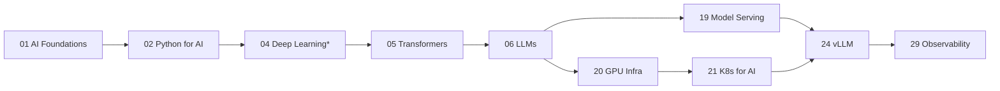
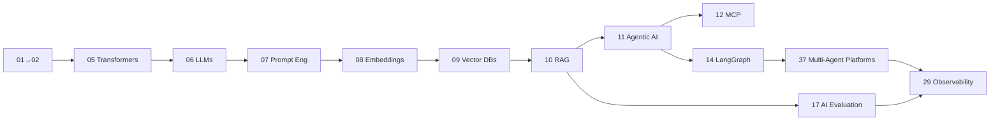
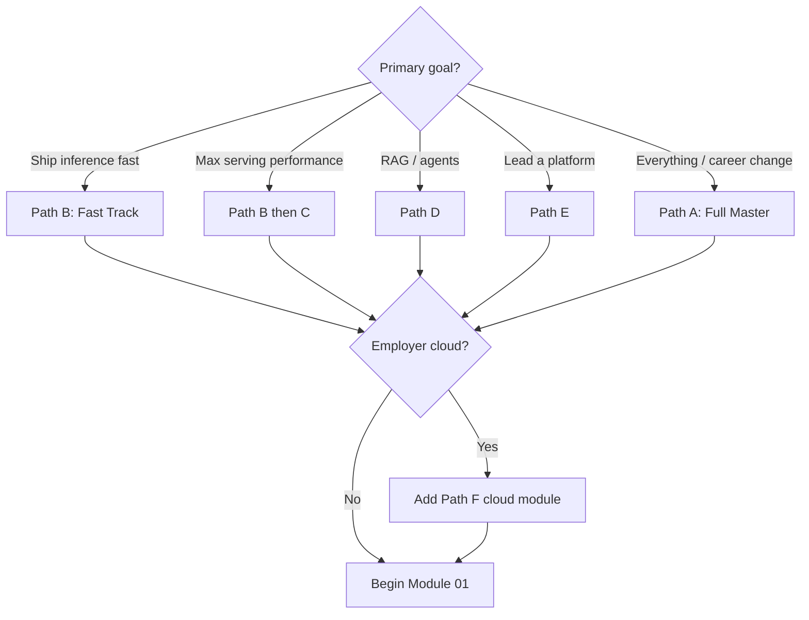

# Learning Paths

Curated routes through the 40 modules for different goals and time budgets. All paths assume you already have the DevOps prerequisites (Linux/K8s/Docker/Terraform/AWS/CI-CD/GitOps/Networking/Security/Monitoring).

Pick **one** path to start. You can switch or extend later — the [knowledge graph](./knowledge-graph.md) shows what any module unlocks.

---

## Path A · Full Master (12–18 months)

The complete program. Do all 40 modules in order. This is the default and the one the capstone assumes.

`01 → 02 → ... → 40` (follow phase order in the [roadmap](./README.md)).

**Outcome:** Staff-level AI Infrastructure Engineer, capable of the full capstone.

---

## Path B · Fast Track to Serving (10–14 weeks)

For an experienced DevOps engineer who needs to **stand up LLM inference in production quickly**.

`*` Skim 03 ML Fundamentals; focus 04 on GPU memory/precision only.

**Outcome:** Can deploy and operate a tuned vLLM service on a GPU cluster with observability.

---

## Path C · Serving / Performance Specialist (add-on to B)

After Path B, go deep on inference performance.

`22 Ray → 23 KServe → 25 SGLang → 26 Triton → 27 TensorRT-LLM → 28 Distributed Inference`

**Outcome:** Can serve very large models across nodes at target SLOs and squeeze GPU performance.

---

## Path D · Agents & RAG Specialist

For roles centered on RAG, agents, and MCP.

**Outcome:** Can build production RAG + multi-agent platforms with evals and observability.

---

## Path E · Platform Architect (Staff/Principal)

For engineers driving toward AI platform leadership. Assumes Paths B + D are done or in progress.

`18 LLMOps → 29 Observability → 30 AI Security → 31 Platform Eng → 32 Enterprise Arch → 33 Cloud AI → (34/35/36) → 37 Multi-Agent Platforms → 38 Capstone`

**Outcome:** Can design, secure, and lead an enterprise AI platform end to end.

---

## Path F · Cloud-Focused (employer-specific)

Layer the relevant cloud module onto any path based on your target employer:

| Employer stack | Add module |
|----------------|-----------|
| AWS-heavy | 34 AWS Bedrock |
| GCP-heavy | 35 GCP Vertex AI |
| Azure-heavy | 36 Azure AI |
| Multi-cloud | 33 Cloud AI + all three |

---

## Choosing Your Path

---

## Weekly Cadence Recommendation

- **10–15 hrs/week:** 1 module every 2–4 weeks (matches the 12–18 month plan).
- **20+ hrs/week:** compresses to ~8–10 months.
- Always spend **≥60% of time in labs/projects**, per the 80/20 hands-on rule.
