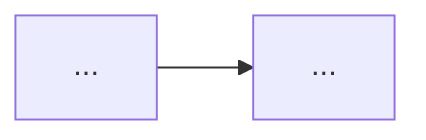

# Lab Template

> Copy into each `labs/NN.X-lab-name/README.md`. Every lab MUST include every section.

---

# Lab NN.X · [Lab Name]  `[difficulty tag]`

## Objective
[One or two sentences: what you'll build and what you'll learn.]

## Architecture
[Mermaid diagram of what the lab builds.]



## Prerequisites
- **Tools:** [versions, e.g. Python 3.11, kubectl 1.30, Helm 3.15]
- **Infra:** [e.g. 1× GPU node (T4/A10), or CPU-only fallback]
- **Prior labs:** [lab numbers]
- **Estimated cost:** [$X if cloud/GPU — else "free/local"]
- **Estimated time:** [minutes]

## Implementation
Step-by-step, copy-pasteable. Each step states its purpose.

```bash
# Step 1 — [purpose]
...
```

## Validation
How to prove it works.

```bash
# Expected: HTTP 200 + a token stream
curl ...
```

## Expected Output
[Show exactly what success looks like — sample output/screenshot description/metrics.]

## Failure Scenarios
| Symptom | Likely cause | Fix |
|---------|--------------|-----|
| [error] | [cause] | [remedy] |

## Debugging Guide
[Ordered checklist to diagnose when it doesn't work: logs to check, metrics, common misconfigurations.]

## Cleanup
> Mandatory. Leave no billable resources running.

```bash
# Tear down everything created in this lab
...
```

## Production Discussion
[How this lab differs from production reality: HA, security, scale, cost, observability, what you'd add before shipping.]
