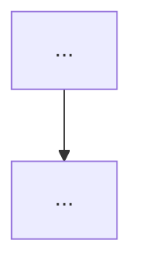

# Module Template

> Copy this into each `NN-module-name/README.md`. Every module MUST include every section. Replace bracketed guidance. Tag content with difficulty levels (`B/I/A/E/S/P`).

---

# NN · [Module Name]

**Track:** [Foundations/Core AI/Serving/...] · **Difficulty band:** `[e.g. A→E]` · **Est. time:** [weeks]

> One-paragraph elevator pitch: what this module makes you capable of and why it matters for an AI platform.

---

## Learning Objectives
By the end you will be able to:
- [Verb-first, measurable objective 1]
- [Objective 2]
- ...

## Required Background
- **From this repo:** [prerequisite module numbers + why]
- **DevOps skills leveraged:** [which existing expertise this builds on]

---

## 1. Theory (WHY before HOW)
[First-principles explanation. Start with the problem, then the concept. Use analogies to DevOps concepts the reader already knows.]

### Architecture
[Mermaid architecture diagram + narrative walkthrough.]

### Trade-offs & Comparisons
[Compare competing technologies/approaches in a table. Explain when to choose what.]

### Failure Modes
[How this component fails in production, and the blast radius of each failure.]

---

## 2. Production Use Cases
[2–4 real-world scenarios with named-company-style patterns. Explain the infra shape.]

---

## 3. Code Examples
[Minimal, runnable examples with imports at top. Link to `labs/` for full versions.]

---

## 4. Hands-On Labs
See [`labs/`](./labs/). Each lab follows the [lab template](../00-roadmap/templates/lab-template.md).
| Lab | Level | Objective |
|-----|-------|-----------|
| NN.1 | `I` | ... |

## 5. Projects
- **Mini project:** [scoped, single-session build] → [`projects/mini/`](./projects/mini/)
- **Large project:** [multi-session production build, versioned v1→...→production] → [`projects/large/`](./projects/large/)

## 6. Design Review
See [`design-reviews/`](./design-reviews/). Includes a reference architecture and ADRs.

---

## 7. Performance Tuning
[Levers, benchmarks, and how to measure. Include target metrics.]

## 8. Security Considerations
[Threats specific to this module + controls. Map to OWASP LLM Top 10 where relevant.]

## 9. Cost Optimization
[Cost model + concrete optimizations + how to measure savings.]

## 10. Scaling Considerations
[How this scales horizontally/vertically; bottlenecks; limits.]

---

## 11. Best Practices
See [`best-practices.md`](./best-practices.md).

## 12. Common Pitfalls
See [`common-pitfalls.md`](./common-pitfalls.md).

## 13. Troubleshooting
See [`troubleshooting.md`](./troubleshooting.md).

## 14. Checklists
See [`checklists.md`](./checklists.md) (readiness, production, security, cost).

---

## 15. Assessments
See [`assessments/`](./assessments/): practical exam, architecture interview, troubleshooting interview, code review, scenario interview, system-design interview, production incident, self-assessment quiz, final exam.

---

## 16. Further Reading
See [`references/`](./references/). Categorized: research papers · GitHub repos · books · videos · blogs · industry standards · RFCs · benchmarks.

---

## Knowledge Graph Position
- **Unlocks:** [modules this enables]
- **Requires:** [prerequisite modules]
- **Critical path?** [yes/no]
