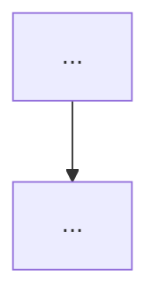

# Project Template

> Copy into each `projects/*/README.md`. Projects are production builds and MUST evolve through versions.

---

# Project · [Project Name]

**Module:** NN · **Type:** [mini / large] · **Difficulty:** `[tag]`

## Problem Statement
[The real-world problem this project solves. Frame it as a product/platform requirement.]

## Requirements
- **Functional:** [what it must do]
- **Non-functional:** [SLOs: latency, throughput, availability, cost budget]

## Architecture

## Version Roadmap
Every project evolves. Each version is a folder or branch with its own README.

| Version | Scope | New capabilities |
|---------|-------|------------------|
| **v1** | MVP | Works locally / single node. |
| **v2** | Hardened | Config, tests, metrics, error handling. |
| **v3** | Scaled | Autoscaling, load-tested to SLO. |
| **Enterprise** | Multi-tenant | AuthN/Z, quotas, audit, RBAC. |
| **Cloud** | Managed | Deployed on AWS/GCP/Azure with IaC. |
| **HA** | Resilient | Redundancy, failover, backups. |
| **Multi-region** | Global | Geo-routing, replication, DR. |
| **Production** | Ship-ready | Full observability, runbooks, on-call, cost model. |

> Not every project reaches every version — the roadmap states which versions are in scope.

## Implementation Guide
[High-level build order referencing labs and code. IaC via Terraform; K8s via Helm/Kustomize + GitOps.]

## Validation & Acceptance
- [ ] Meets functional requirements
- [ ] Meets SLOs under load test
- [ ] Observability: traces, metrics, logs, dashboards
- [ ] Security controls in place + threat model
- [ ] Cost within budget + documented cost model
- [ ] Runbook + teardown documented

## Deliverables
[Repo layout, IaC, dashboards, design doc, demo, and a short write-up.]

## Extension Ideas
[Stretch goals that push toward the next difficulty band.]
