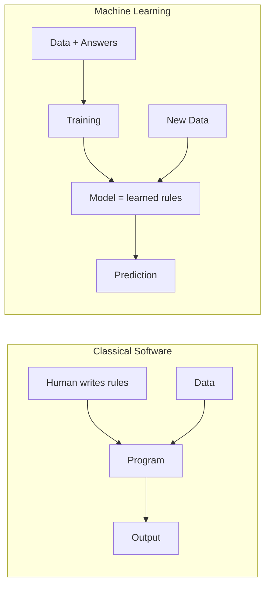
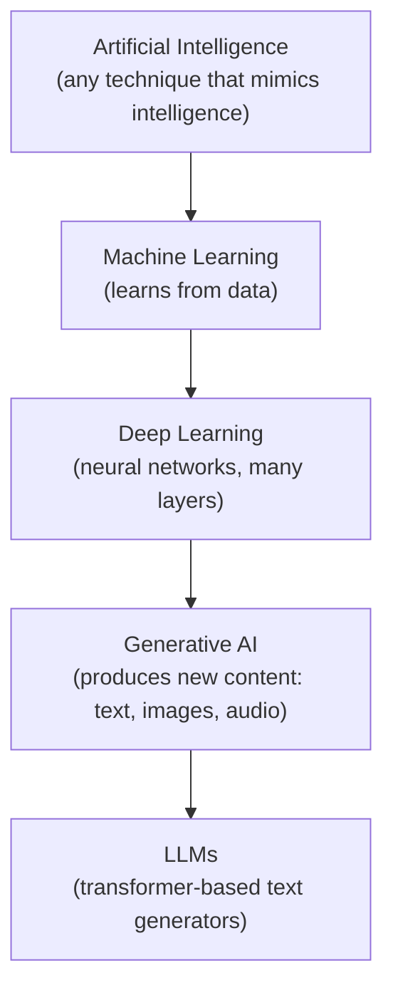
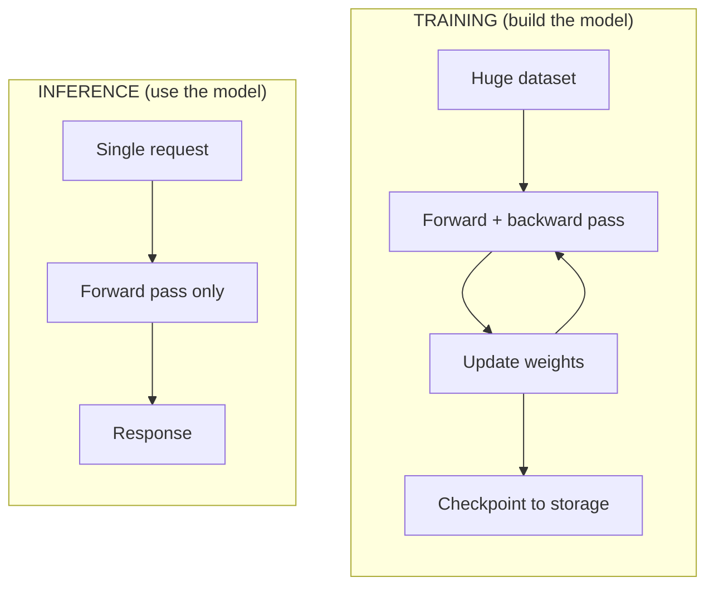
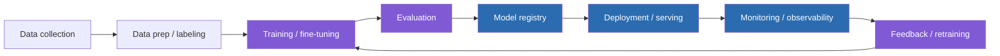
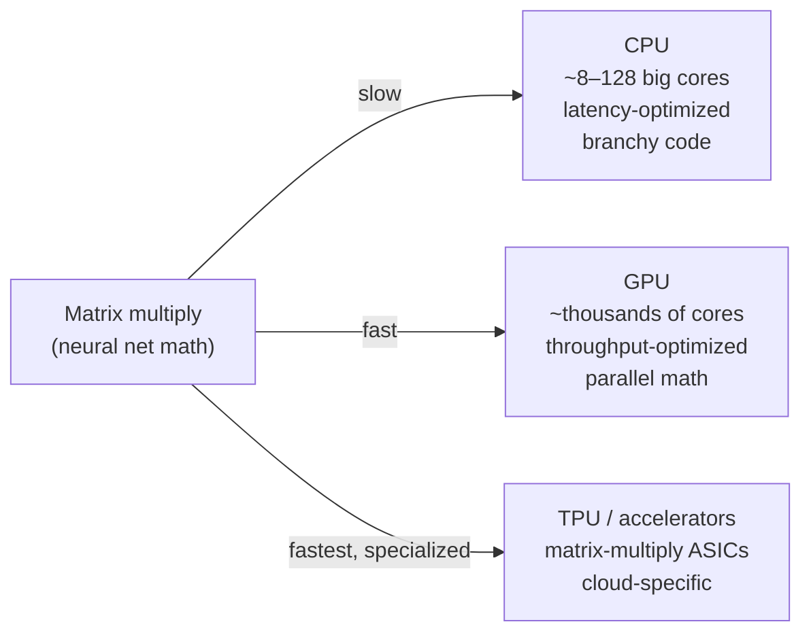
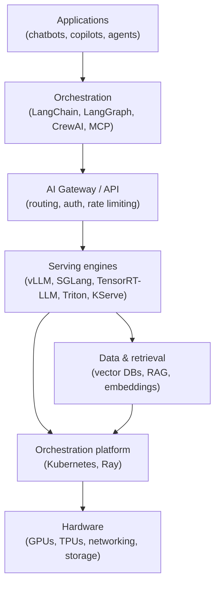

# 01 · AI Foundations

**Track:** Foundations · **Difficulty band:** `B→I` · **Est. time:** 2–3 weeks

> You are an expert in operating systems that *someone else* built. This module makes AI systems stop being a black box. By the end, "AI", "ML", "a model", "training", and "inference" will be as concrete to you as "process", "binary", "compile", and "run". You will be able to look at any AI product and draw its infrastructure.

---

## Learning Objectives
By the end you will be able to:
- **Define precisely** the relationships between AI, ML, DL, and Generative AI — and place any real system in that hierarchy.
- **Explain** the difference between **training** and **inference** as *workloads* (compute shape, memory, cost, latency) — the single most important distinction for an infra engineer.
- **Map** the end-to-end ML lifecycle and identify which stages are *platform* concerns you will own.
- **Describe** the AI hardware landscape (CPU vs GPU vs TPU vs other accelerators) and *why* GPUs dominate.
- **Draw** the modern AI stack from silicon to application, and locate every tool from later modules within it.
- **Reverse-engineer** a real AI product into an infrastructure diagram (the module project).
- **Estimate**, at order-of-magnitude, the compute/memory/cost of running a model.

## Required Background
- **From this repo:** none — this is the entry point.
- **DevOps skills leveraged:** everything. We map AI concepts onto ones you already own:
  - a **model** ≈ a compiled artifact + weights (like a binary + large read-only data file)
  - **inference** ≈ a stateless (mostly) request/response service you must scale and observe
  - **training** ≈ a massive, stateful, checkpointed batch job (like a huge distributed CI build)
  - **GPUs** ≈ specialized, expensive, scarce nodes needing their own scheduling and drivers

---

## 1. Theory (WHY before HOW)

### 1.1 The problem AI actually solves
Classical software encodes **rules a human wrote**: `if country == "US": tax = 0.07`. This breaks down when the rules are unknown, too numerous, or fuzzy ("is this email spam?", "what's in this image?", "answer this question"). **Machine learning inverts the model**: instead of writing rules, you show a system many examples and it *learns an approximate function* that maps inputs to outputs.



> **WHY this matters to you:** the artifact you deploy (a *model*) is not deterministic-by-inspection like a normal binary. It's a giant array of learned numbers (*weights*). This changes how you version, test, observe, secure, and roll it back — themes of this entire handbook.

### 1.2 The hierarchy: AI ⊃ ML ⊃ DL ⊃ GenAI
See the full deep-dive in [`theory/01-ai-ml-dl-genai.md`](./theory/01-ai-ml-dl-genai.md).



| Term | One-line definition | Example | Your infra concern |
|------|--------------------|---------| -------------------|
| **AI** | Any system exhibiting "intelligent" behavior | A chess engine's rules | Rare pure-AI infra today |
| **ML** | Learns a function from data | Fraud detection, recommendations | Feature stores, batch scoring |
| **DL** | ML using deep neural networks | Image recognition, speech | GPUs enter the picture |
| **GenAI** | DL that *generates* content | Image generation, chatbots | Streaming, large weights, KV cache |
| **LLM** | GenAI for text via transformers | GPT, Claude, Llama | The bulk of this handbook |

### 1.3 Training vs Inference — the defining distinction
This is the concept an AI infra engineer must never blur. They are *completely different workloads*.



| Dimension | Training | Inference |
|-----------|----------|-----------|
| Frequency | Occasional, long-running (hours→months) | Continuous, per-request |
| Compute shape | Throughput-bound, huge batches | Latency-sensitive, small batches |
| State | Stateful, checkpointed | Mostly stateless (KV cache is per-request) |
| Failure handling | Resume from checkpoint | Retry request |
| Cost driver | GPU-hours × scale | GPU utilization × traffic |
| DevOps analogy | A massive distributed batch build | A high-QPS microservice |
| Who owns it (usually) | ML/research teams | **You** (platform/infra) |

> **WHY:** ~90% of an AI *platform* engineer's day is **inference and the lifecycle around it**, not training. This handbook reflects that — training is understood, but serving/scaling/operating is mastered.

### 1.4 Architecture: where infrastructure lives
The end-to-end lifecycle, annotated with which stages you own. Full version in [`theory/02-ml-lifecycle.md`](./theory/02-ml-lifecycle.md).


Blue = primarily platform/infra ownership · Purple = shared with ML teams.

### 1.5 The hardware landscape (WHY GPUs)
Full deep-dive: [`theory/03-hardware-landscape.md`](./theory/03-hardware-landscape.md).

Neural networks are, at their core, **massive matrix multiplications**. CPUs have few, powerful, general cores optimized for sequential logic; GPUs have thousands of simple cores optimized for doing the *same* math on lots of data in parallel — exactly the shape of a matrix multiply.



| Hardware | Best for | Downsides | You'll meet it in |
|----------|----------|-----------|-------------------|
| CPU | Data prep, small models, orchestration | Slow for DL math | Everywhere |
| **GPU (NVIDIA)** | Training + inference of DL/LLMs | Expensive, scarce, driver complexity | Modules 20, 24–28 |
| TPU (Google) | Large-scale training/inference on GCP | Vendor lock-in, XLA toolchain | Module 35 |
| Inferentia/Trainium (AWS), others | Cost-optimized cloud inference | Ecosystem maturity | Modules 33–34 |

### 1.6 The modern AI stack (the map for this whole handbook)

Every later module slots into a layer here. Keep this diagram in mind as your table of contents.

### Trade-offs & Comparisons
- **Build vs buy (self-host vs API):** running your own model on GPUs gives control, data privacy, and cost predictability at scale, but demands the entire stack above. Calling a hosted API (OpenAI/Bedrock) is instant but costs per-token and sends data out. This tension recurs in every module; see [`theory/04-build-vs-buy.md`](./theory/04-build-vs-buy.md).
- **Latency vs throughput:** training maximizes throughput; interactive inference minimizes latency; batch inference maximizes throughput again. The right choice reshapes hardware and serving decisions.

### Failure Modes (foundational intuition)
- **Silent quality degradation:** unlike a crashed service, a model can keep returning 200s while producing worse answers (data drift, bad prompt change). Requires *evaluation-as-monitoring* (Module 17, 29).
- **Non-determinism:** same input can yield different output → testing and rollback differ from classic software.
- **Resource starvation:** one oversized model can consume an entire GPU; noisy neighbors and OOM are routine (Modules 20, 24).

---

## 2. Production Use Cases
1. **Customer-support copilot (RAG + LLM):** infra shape = vector DB + embedding pipeline + LLM serving + gateway + observability. You'll build this across Modules 09–10, 24, 29.
2. **Fraud detection (classical ML):** batch feature pipeline + low-latency scoring service; shows not all "AI" needs GPUs.
3. **Internal AI platform:** many teams self-serving models/agents on shared GPUs — the endgame (Module 31, capstone).
4. **Image generation service:** large weights, long inference, GPU memory pressure — illustrates why serving engines matter.

## 3. Code Examples
Foundational, CPU-only, to make concepts tangible. Full runnable versions live in the labs.

```python
# The essence of "inference": a model is just a function that maps input -> output.
# Here the "model" is trivial, but the SHAPE is identical to an LLM forward pass.
import numpy as np

weights = np.array([0.5, -0.2, 0.1])   # "learned" parameters
bias = 0.05

def model(x: np.ndarray) -> float:      # forward pass = inference
    return float(x @ weights + bias)

print(model(np.array([1.0, 2.0, 3.0])))  # deterministic here; real LLMs sample
```

```python
# The essence of "training": adjust weights to reduce error (gradient descent, 1 step).
x = np.array([1.0, 2.0, 3.0]); target = 1.0; lr = 0.01
pred = model(x)
error = pred - target
weights = weights - lr * error * x       # this loop, billions of times, IS training
```

## 4. Hands-On Labs
See [`labs/`](./labs/). 80% of your time lives here.

| Lab | Level | Objective |
|-----|-------|-----------|
| [01.1](./labs/01.1-cpu-vs-gpu-matmul/) | `I` | Feel training vs inference and CPU vs GPU by benchmarking matrix multiplies. |
| [01.2](./labs/01.2-first-inference-service/) | `I` | Wrap a real pretrained model in a FastAPI inference service; observe latency/throughput. |
| [01.3](./labs/01.3-teardown-an-ai-product/) | `A` | Reverse-engineer a real AI product into an infrastructure diagram. |

## 5. Projects
- **Mini project:** [`projects/mini/`](./projects/mini/) — a "hello inference" service with metrics, containerized, load-tested.
- **Large project:** [`projects/large/`](./projects/large/) — **AI System Teardown Report**: pick a public AI product, infer and document its full infrastructure with diagrams, cost model, and failure analysis (evolves v1→production).

## 6. Design Review
See [`design-reviews/`](./design-reviews/): a reference architecture for a minimal inference service + ADRs (self-host vs API, CPU vs GPU for a given workload).

---

## 7. Performance Tuning
At this level, tuning = *measuring the right thing*. Learn to reason in: **latency (p50/p95/p99)**, **throughput (RPS / tokens per second)**, and **utilization (GPU %)**. Lab 01.1 and 01.2 make you measure all three. Target intuition: a forward pass is FLOPs ≈ 2 × parameters per token — memorize this order-of-magnitude estimator.

## 8. Security Considerations
Foundational threats to internalize now (deep-dived in Module 30): models can **memorize and leak training data**; inputs are **untrusted** (prompt injection later); model files are **supply-chain artifacts** (a pickled model can execute code — prefer `safetensors`). Treat weights as sensitive data with provenance.

## 9. Cost Optimization
The foundational cost equation: **cost ≈ GPU-hours × price** for both training and inference. Two levers dominate everything later: **utilization** (don't pay for idle GPUs) and **right-sizing** (don't use an A100 for a job a CPU can do). Lab 01.3 includes building a first cost model.

## 10. Scaling Considerations
Inference scales like a stateless service *until* GPU memory and model size intervene (why Modules 20, 24, 28 exist). Training scales by adding GPUs/nodes with communication overhead. Recognize which axis a given system scales on.

---

## 11. Best Practices
See [`best-practices.md`](./best-practices.md).

## 12. Common Pitfalls
See [`common-pitfalls.md`](./common-pitfalls.md).

## 13. Troubleshooting
See [`troubleshooting.md`](./troubleshooting.md).

## 14. Checklists
See [`checklists.md`](./checklists.md).

---

## 15. Assessments
See [`assessments/`](./assessments/): self-assessment quiz, practical exam, architecture interview, troubleshooting interview, code review, scenario interview, system-design interview, production incident, and the module final exam.

---

## 16. Further Reading
See [`references/`](./references/README.md): categorized papers, repos, books, videos, blogs, standards, RFCs, and benchmarks.

---

## Knowledge Graph Position
- **Requires:** — (entry point)
- **Unlocks:** `02 Python for AI` and the entire curriculum.
- **Critical path?** **Yes.**
