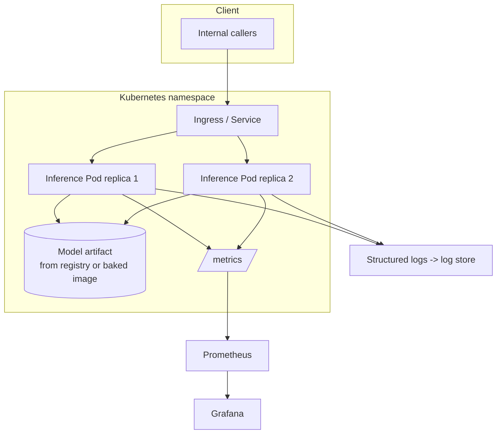

# Reference Architecture · Minimal Inference Service

**Module:** 01 · **Difficulty:** `A`

The smallest architecture worth calling "production-shaped" for serving a single model. Everything later in the handbook is an elaboration of this. Use it as the baseline you defend in the design review.

## Context
A single team needs to expose one model (classical ML classifier *or* a small LLM) as an internal HTTP API with basic reliability and observability. Low/moderate traffic. No multi-tenancy yet.

## Architecture

## Key decisions (see ADRs)
- **Self-host vs managed API** for this workload → [ADR-0001](./adr/0001-self-host-vs-managed-api.md).
- **CPU vs GPU** for this model size → [ADR-0002](./adr/0002-cpu-vs-gpu-for-workload.md).

## Component responsibilities
| Component | Responsibility | Later module |
|-----------|----------------|--------------|
| Ingress/Service | Route + load-balance requests | K8s (you know this) |
| Inference Pods | Run the model, expose `/predict`, `/healthz`, `/readyz`, `/metrics` | 19 |
| Model artifact | Versioned weights, pulled from registry or baked into image | 18 |
| Prometheus/Grafana | Metrics + dashboards (latency, RPS, errors, saturation) | 29 |
| Log store | Structured request logs | 29 |

## What's intentionally missing (and where it's added)
| Missing | Why it matters | Added in |
|---------|----------------|----------|
| Batching | GPU/CPU efficiency | 19, 24 |
| Autoscaling on GPU metrics | Cost + burst handling | 21, 24 |
| AI gateway (auth, rate limit, routing) | Multi-tenant safety + cost control | 31 |
| Vector DB / RAG | Grounded answers | 09, 10 |
| Quality evals as monitoring | Catch silent degradation | 17, 29 |
| DR / multi-region | Resilience | 32 |

## Non-functional targets (baseline)
- Availability: single-region, ≥ 99.5% (best-effort).
- Latency: define p95 SLO per model; alert on breach.
- Observability: RED metrics (Rate, Errors, Duration) + saturation.
- Rollout: rolling deploy with `readyz` gating; manual rollback.

## Review questions to defend
1. Why 2 replicas — what does the 2nd buy you, and what doesn't it protect against?
2. Where does the model artifact come from, and how do you roll it back?
3. What's your first scaling bottleneck as traffic 10×, and what do you add?
4. How would you know the model got *worse* (not just slower)?
