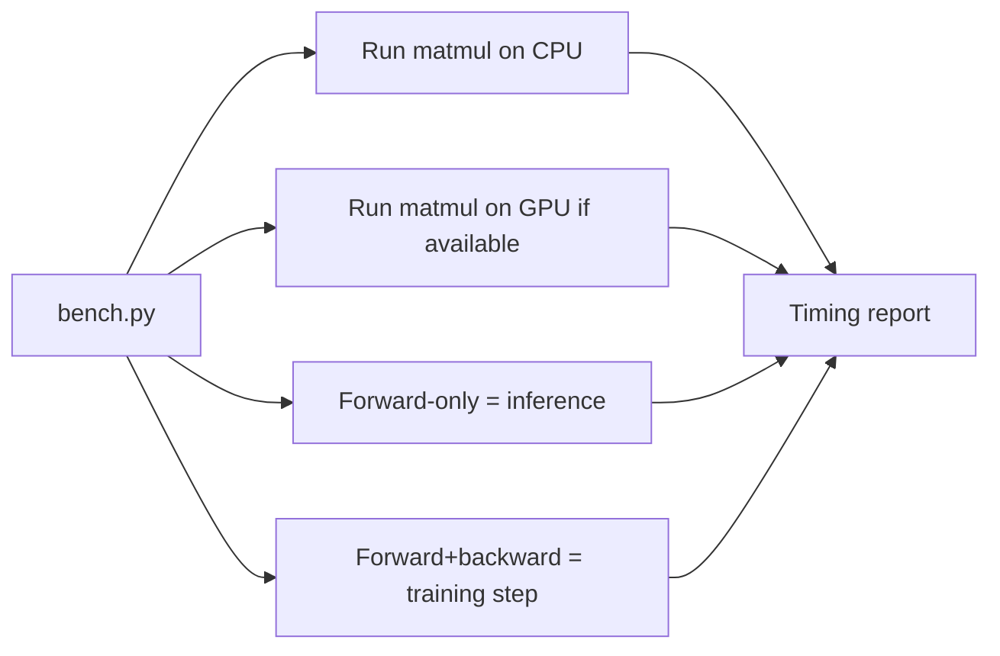

# Lab 01.1 · Feel Training vs Inference & CPU vs GPU  `I`

## Objective
Make three abstract concepts physical by measuring them yourself: (1) neural-net work is matrix multiplication, (2) GPUs crush CPUs at it, and (3) "training" (forward+backward) costs more than "inference" (forward only). You'll produce a small benchmark report.

## Architecture


## Prerequisites
- **Tools:** Python 3.11+, `uv` (or `pip`). See [`requirements.txt`](./requirements.txt).
- **Infra:** CPU is enough. A GPU (local NVIDIA, or a cloud VM) makes the comparison dramatic but is **optional**.
- **Prior labs:** none.
- **Estimated cost:** free (local) or ~$1 if you spin a cloud GPU VM for 30 min.
- **Estimated time:** 20–30 min.

## Implementation
```bash
# Step 1 — create an isolated environment and install deps
uv venv && source .venv/bin/activate     # or: python -m venv .venv && source .venv/bin/activate
uv pip install -r requirements.txt        # installs torch, numpy

# Step 2 — run the benchmark (auto-detects CUDA)
python bench.py --sizes 512 1024 2048 4096 --iters 20
```

`bench.py` does, for each matrix size N:
1. A **forward-only** matmul (`A @ B`) — the shape of *inference*.
2. A **forward + backward** pass (autograd) — the shape of a *training* step.
3. Runs on CPU, and on GPU if `torch.cuda.is_available()`.

## Validation
```bash
python bench.py --sizes 1024 --iters 5
# Expect a table printing device, op, size, avg_ms, and GFLOP/s.
```

## Expected Output
On a machine with a GPU you'll see something like (numbers vary by hardware):
```
device  op                 N     avg_ms   GFLOP/s
cpu     forward           1024    8.10       265
cpu     forward+backward  1024   24.5         88
cuda    forward           1024    0.21     10200
cuda    forward+backward  1024    0.68      3100
```
Two lessons jump out: **GPU is ~10–100× faster**, and **training (fwd+bwd) is ~3× the cost of inference (fwd)** — because backprop adds a backward pass plus a weight-update.

## Failure Scenarios
| Symptom | Likely cause | Fix |
|---------|--------------|-----|
| `CUDA not available`, only cpu rows | No GPU / driver / CUDA torch build | Expected on CPU-only; to use GPU install the CUDA build of torch matching your driver |
| `RuntimeError: CUDA out of memory` | N too large for your VRAM | Lower `--sizes` (e.g. drop 4096) |
| Very slow CPU run | Large N on CPU | Reduce sizes/iters; CPU is meant to be slow here |
| `ModuleNotFoundError: torch` | deps not installed / wrong venv | Re-run install inside the activated venv |

## Debugging Guide
1. Confirm the venv is active (`which python` points into `.venv`).
2. `python -c "import torch; print(torch.__version__, torch.cuda.is_available())"`.
3. If GPU expected but `False`: check `nvidia-smi` works, and that you installed a CUDA-enabled torch wheel (CPU wheels never see CUDA).
4. Watch `nvidia-smi -l 1` in another terminal during the run to see GPU utilization spike.

## Cleanup
```bash
deactivate
rm -rf .venv
# If you used a cloud GPU VM, DESTROY it now (biggest cost risk).
```

## Production Discussion
This toy foreshadows real infra decisions:
- **Why serving engines exist:** naive per-request matmuls waste the GPU; batching many requests keeps those thousands of cores busy (Module 24).
- **Why VRAM rules:** the OOM you can trigger here is the same failure that limits model size in production (Module 20, 28).
- **Why we quantize:** smaller number formats (FP16/FP8/INT4) move less data and use Tensor Cores, raising GFLOP/s — the lever behind Module 06's quantization.
- **Training vs inference cost:** the ~3× gap you measured is why training clusters and inference clusters are sized and scheduled differently.
