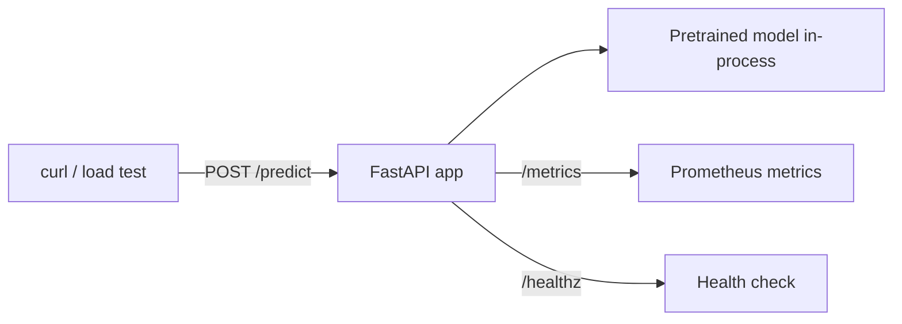

# Lab 01.2 · Your First Inference Service  `I`

## Objective
Turn a real pretrained model into a production-shaped HTTP inference service, then observe its latency and throughput under load. This is the smallest possible version of what you'll build for the rest of the handbook — and it maps directly onto your existing microservice/observability skills.

## Architecture


## Prerequisites
- **Tools:** Python 3.11+, `uv`/`pip`, Docker (optional), `hey` or `ab` for load testing.
- **Infra:** CPU-only. The model is a tiny sentiment classifier (~possible on CPU).
- **Prior labs:** 01.1 recommended.
- **Estimated cost:** free (local).
- **Estimated time:** 40–60 min.

## Implementation
```bash
# Step 1 — environment + deps
uv venv && source .venv/bin/activate
uv pip install -r requirements.txt

# Step 2 — run the service (first run downloads the small model)
uvicorn app:app --host 0.0.0.0 --port 8000

# Step 3 — (optional) containerize it, reusing your Docker skills
docker build -t infer-svc:0.1 .
docker run -p 8000:8000 infer-svc:0.1
```

The service (`app.py`) exposes:
- `POST /predict` — body `{"text": "..."}` → sentiment label + score, plus per-request latency.
- `GET /healthz` — liveness.
- `GET /metrics` — Prometheus metrics: request count, in-flight, latency histogram.

## Validation
```bash
# Single prediction
curl -s -X POST localhost:8000/predict \
  -H 'content-type: application/json' \
  -d '{"text":"This handbook is fantastic"}' | jq

# Health + metrics
curl -s localhost:8000/healthz
curl -s localhost:8000/metrics | grep inference_requests_total
```

## Expected Output
```json
{
  "label": "POSITIVE",
  "score": 0.9998,
  "latency_ms": 42.7,
  "model": "distilbert-base-uncased-finetuned-sst-2-english"
}
```

Now load test it and watch latency vs throughput:
```bash
# 500 requests, 20 concurrent
hey -n 500 -c 20 -m POST \
  -H 'content-type: application/json' \
  -d '{"text":"great"}' http://localhost:8000/predict
```
Observe: as concurrency rises, **throughput (RPS) climbs then plateaus** while **p95 latency grows** — because a CPU-bound, single-process model server has finite parallelism. This is *exactly* the batching/scaling problem serving engines solve later.

## Failure Scenarios
| Symptom | Likely cause | Fix |
|---------|--------------|-----|
| First request very slow / hangs | Model downloading on first call | Warm the model at startup (already done in `app.py`); wait for download |
| `OSError: can't load model` | No internet / HF blocked | Pre-download the model, or set `HF_HOME` to a cached dir |
| High p99 under load | Single worker, CPU-bound | Add workers (`--workers`) — note the trade-offs in Production Discussion |
| Port already in use | Something on 8000 | Change `--port` |

## Debugging Guide
1. Hit `/healthz` first — if that fails, the app didn't start (check the uvicorn logs).
2. Check `/metrics` for `inference_inflight` to see concurrency.
3. Time a single request before load testing to get a clean baseline latency.
4. If containerized, confirm the model is baked in or cached so the container doesn't download on every start (a real production concern).

## Cleanup
```bash
# Stop uvicorn (Ctrl-C). If containerized:
docker ps -q --filter ancestor=infer-svc:0.1 | xargs -r docker stop
docker rmi infer-svc:0.1 || true
deactivate && rm -rf .venv
```

## Production Discussion
This lab is deliberately naive so you can see what's missing — every gap here is a future module:
- **No batching** → wasted compute; serving engines add dynamic/continuous batching (Modules 19, 24).
- **In-process model** → scaling means duplicating the whole model per replica; large models can't do this (Modules 20, 28).
- **No GPU** → fine for a tiny classifier, impossible for an LLM (Module 20).
- **Metrics but no traces/quality** → real AI observability adds token/cost metrics and quality evals (Modules 17, 29).
- **No auth / rate limiting** → an AI gateway adds these (Module 31).
- **Cold start = model download** → registries + pre-baked images fix this (Module 18).

You just built the "hello world" of the entire discipline. Keep this service; the mini project hardens it.
