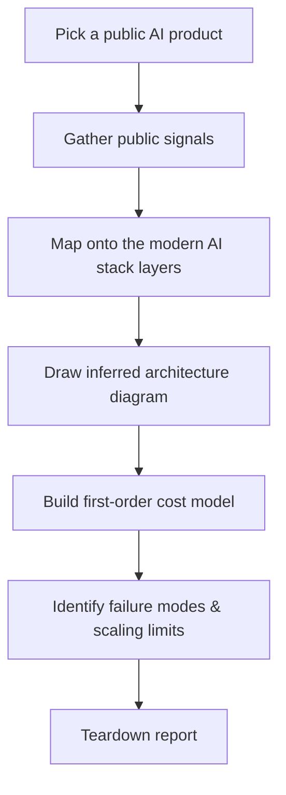

# Lab 01.3 · Reverse-Engineer a Real AI Product  `A`

## Objective
Develop the core skill of an AI architect: looking at *any* AI product and inferring its infrastructure. You'll pick a real product, deduce its stack layer by layer, draw its architecture, and build a first-order cost model — with no insider information, only public signals and sound reasoning.

## Architecture
This lab produces an artifact rather than a running system. The "architecture" is your analytical method:

## Prerequisites
- **Tools:** any Markdown editor; Mermaid for diagrams. No code required.
- **Infra:** none.
- **Prior labs:** 01.1, 01.2 (so the stack layers feel concrete).
- **Estimated cost:** free.
- **Estimated time:** 60–90 min.

## Implementation
Work through the [`worksheet.md`](./worksheet.md) in this folder. Steps:

1. **Choose a product.** Good candidates: a coding copilot, a customer-support chatbot, an image generator, a "chat with your docs" app, or an AI search engine. Pick something with a public interface you can poke at.
2. **Collect signals (WHY each matters):**
   - Streaming responses? → token-by-token generation → an LLM behind a serving engine.
   - "Sources" / citations? → retrieval + a vector DB → RAG (Module 10).
   - Latency to first token vs full answer? → hints at model size + batching.
   - Rate limits / tiers? → an AI gateway with quotas (Module 31).
   - Regions / data-residency claims? → multi-region + governance (Modules 30, 32).
   - Pricing per token/request/seat? → their cost model and margin pressure.
3. **Map to the stack** (use the 7-layer diagram from the module README). For each layer, state what you *infer* and the *evidence*.
4. **Draw the inferred architecture** as a Mermaid diagram.
5. **Build a first-order cost model** (see the worksheet's cost section).
6. **Identify failure modes and scaling limits.**

## Validation
Your teardown is "valid" when a peer can read it and:
- follow your evidence → inference chain for each layer,
- see a labeled architecture diagram,
- see at least one quantified cost estimate with stated assumptions,
- see 3+ failure modes with blast radius.

Self-check against [`rubric.md`](./rubric.md).

## Expected Output
A completed `teardown-report.md` (start from the worksheet) containing:
- product + interface description,
- per-layer inference table (inference | evidence | confidence),
- Mermaid architecture diagram,
- cost model with assumptions,
- failure modes + scaling limits,
- open questions you'd ask if you joined the team.

Example inference-table row:
| Layer | Inference | Evidence | Confidence |
|-------|-----------|----------|-----------|
| Serving | LLM served via a batching engine (e.g. vLLM) | Streamed tokens, ~300ms TTFT, higher latency under load | Medium |

## Failure Scenarios
| Symptom (in your analysis) | Likely cause | Fix |
|----------------------------|--------------|-----|
| Every layer marked "high confidence" | Over-claiming without evidence | Downgrade to what signals actually support |
| No cost model | Skipped the quantitative step | Even a rough estimate with assumptions is required |
| Diagram = one box "AI" | Not decomposed | Force at least the 7 stack layers |

## Debugging Guide
If you're stuck inferring a layer, ask: *what would have to be true infrastructurally for the behavior I observe?* Streaming ⇒ generation loop ⇒ serving engine. Citations ⇒ retrieval ⇒ vector store. Personalization ⇒ per-user state ⇒ a data layer.

## Cleanup
None — keep your report; it seeds the module's large project.

## Production Discussion
This is the exact reasoning used in architecture interviews and in due-diligence on vendors. Senior AI-infra engineers do this reflexively. Revisit your teardown after Modules 10, 24, and 31 — you'll be shocked how much more you can infer, and how your confidence calibration improves. That delta is the point of this lab.
