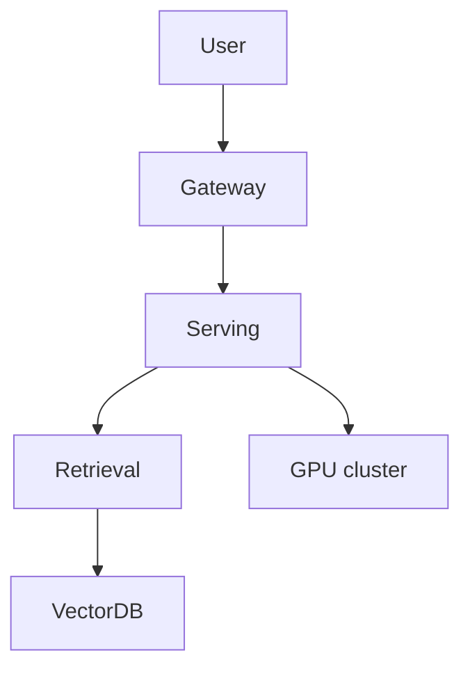

# Teardown Worksheet

Copy this to `teardown-report.md` and fill it in. Delete the guidance in italics.

## 1. Product
- **Name / type:** _(e.g. AI coding copilot)_
- **Public interface:** _(web app, API, IDE plugin...)_
- **What it does for the user:** _(one paragraph)_

## 2. Observed signals
_List concrete, observable behaviors and what each implies._
| Signal (what you observed) | Implication |
|----------------------------|-------------|
| _Streams tokens_ | _LLM generation loop behind a serving engine_ |
| _Shows sources_ | _Retrieval + vector DB (RAG)_ |
| _Free/Pro tiers with limits_ | _AI gateway with quotas_ |
| ... | ... |

## 3. Inferred stack (map to the 7 layers)
| Layer | Inference | Evidence | Confidence (L/M/H) |
|-------|-----------|----------|--------------------|
| Applications | | | |
| Orchestration (agents/chains/MCP) | | | |
| AI Gateway / API | | | |
| Serving engine | | | |
| Data & retrieval (vector DB, RAG) | | | |
| Orchestration platform (K8s/Ray) | | | |
| Hardware (GPU/TPU/cloud) | | | |

## 4. Inferred architecture diagram

## 5. First-order cost model
_State assumptions explicitly; order-of-magnitude is fine._
- **Assumed model size:** _(e.g. ~70B params, or a hosted API)_
- **Assumed traffic:** _(e.g. 100 req/s, ~1k tokens/req)_
- **If self-hosted:** GPUs needed ≈ _(tokens/s ÷ per-GPU tokens/s)_; cost ≈ GPUs × $/hr.
- **If API-based:** cost ≈ tokens/day × $/token.
- **Estimated monthly infra cost:** _____ (show the arithmetic)

## 6. Failure modes & scaling limits
| Failure mode | Blast radius | Likely mitigation |
|--------------|-------------|-------------------|
| _GPU capacity exhausted at peak_ | _Latency spikes / errors_ | _Autoscaling + queue + spillover to API_ |
| ... | | |

## 7. Open questions
_If you joined this team tomorrow, what 5 questions would you ask about the infra?_
1.
2.
3.
4.
5.
