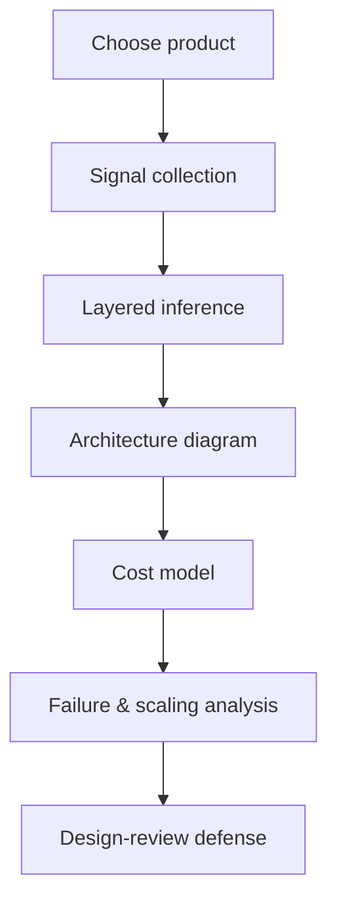

# Large Project · AI System Teardown Report

**Module:** 01 · **Type:** large · **Difficulty:** `A`

## Problem Statement
Produce a professional-grade **architecture teardown** of a real, well-known AI product — the kind of document a Staff engineer writes before a build-vs-buy decision or a vendor due-diligence review. This is the flagship deliverable of Module 01 and the first entry in your design portfolio. It builds directly on [Lab 01.3](../../labs/01.3-teardown-an-ai-product/).

## Requirements
- **Functional:** a complete written report inferring the product's full infrastructure with evidence.
- **Non-functional (quality bar):**
  - Every inference is backed by an observable signal + calibrated confidence.
  - All 7 stack layers analyzed.
  - Quantified cost model with explicit assumptions.
  - Failure-mode + scaling analysis.
  - Diagrams in Mermaid.

## Architecture

## Version Roadmap
This project *evolves as you complete later modules* — revisit and deepen it. That evolution is the point: it measures your growth.

| Version | When | New depth added |
|---------|------|-----------------|
| **v1** | End of Module 01 | Layered inference, diagram, rough cost model, failure modes. |
| **v2** | After Module 10 (RAG) | Detailed retrieval/vector-DB/RAG analysis; ingestion + eval concerns. |
| **v3** | After Module 24 (vLLM) | Serving-engine specifics: batching, KV cache, GPU sizing, tokens/s math. |
| **Enterprise** | After Module 31 | Gateway, multi-tenancy, quotas, auth, model routing, FinOps. |
| **Production** | After Module 32 | DR, multi-region, compliance, capacity planning, full ADR set. |

Keep each version (e.g. `v1.md`, `v2.md`) so the progression is visible.

## Implementation Guide
1. Complete Lab 01.3 to produce the `teardown-report.md` skeleton.
2. Expand each section to report quality (evidence tables, calibrated confidence).
3. Build the cost model with real public price references (cite them) and show arithmetic.
4. Add a **"if I owned this platform"** section: top 3 risks + what you'd change.
5. Prepare to defend it in the [design review](../../design-reviews/) — this doubles as the module's architecture-interview practice.

## Validation & Acceptance
- [ ] All 7 layers analyzed with evidence + confidence.
- [ ] Mermaid architecture diagram consistent with the inference table.
- [ ] Cost model quantified with cited assumptions + arithmetic.
- [ ] ≥ 5 failure modes with blast radius + mitigation.
- [ ] Scaling limits identified (what breaks first as traffic 10×?).
- [ ] "If I owned it" section with prioritized risks.
- [ ] Passes the Lab 01.3 rubric at avg ≥ 4.

## Deliverables
`v1.md` (and later versions), all diagrams inline, a references section citing every public source used, and a one-paragraph executive summary at the top.

## Extension Ideas
- Teardown *two competing* products and write a comparison + recommendation.
- Add a sensitivity analysis: how does the cost model change if traffic 10×, or if they switch from API to self-hosted?
- Record a 5-minute talk-through as if presenting to a design-review board.
