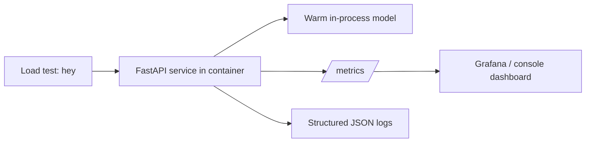

# Mini Project · Hardened "Hello Inference" Service

**Module:** 01 · **Type:** mini · **Difficulty:** `I`

## Problem Statement
Take the naive service from [Lab 01.2](../../labs/01.2-first-inference-service/) and make it *operable*: containerized, observable, load-tested, and documented — the standard you'd expect of any service you'd let into a real cluster. No new AI concepts; this cements that AI services are still services.

## Requirements
- **Functional:** `POST /predict` sentiment endpoint; `/healthz`, `/readyz`, `/metrics`.
- **Non-functional (SLOs for this exercise):**
  - p95 latency < 250 ms at 10 concurrent on a laptop CPU.
  - Sustained ≥ 20 RPS without errors.
  - Model warm at startup (no cold-start on first user request).
  - Clean structured logs + Prometheus metrics.

## Architecture

## Version Roadmap
| Version | Scope | New capabilities |
|---------|-------|------------------|
| **v1** | MVP | Lab 01.2 service running locally. |
| **v2** | Hardened | Add `/readyz`, structured logging, config via env, input validation + limits, unit tests. |
| **v3** | Scaled | Container + docker-compose with Prometheus; load-tested to the SLOs; document the latency/throughput curve. |

_(Enterprise/cloud/HA/multi-region versions are out of scope here — they arrive in Modules 19+.)_

## Implementation Guide
1. Start from the lab's `app.py`, `requirements.txt`, `Dockerfile`.
2. **v2:** add a `readyz` that returns 200 only after the model loads; add `pydantic` field limits (max text length); add `structlog`-style JSON logging; write `pytest` tests for `/predict` happy path + validation errors.
3. **v3:** add a `docker-compose.yml` running the service + Prometheus scraping `/metrics`; run `hey` at increasing concurrency (1, 5, 10, 20, 40); record p50/p95/p99 and RPS at each level into a small table + a note on where it saturates and why.

## Validation & Acceptance
- [ ] Meets the SLOs above (show the load-test table).
- [ ] `/readyz` gates traffic until model loaded.
- [ ] Metrics scraped by Prometheus; at least request-rate + latency-histogram panels.
- [ ] Tests pass (`pytest`).
- [ ] Input validation rejects oversized/empty input with 4xx.
- [ ] README documents run + teardown.

## Deliverables
A self-contained folder: service code, tests, Dockerfile, docker-compose, a `PERF.md` with the latency/throughput table + interpretation, and a teardown section.

## Extension Ideas
- Add a second model and a `?model=` param → foreshadows model routing (Module 18).
- Add a simple in-memory response cache → foreshadows prompt/response caching (Modules 10, 29).
- Add a `/predict/batch` endpoint that batches N inputs → feel the throughput gain that motivates serving engines (Module 24).
