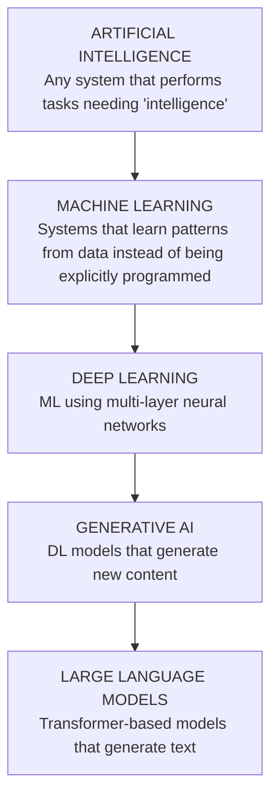

# Deep Dive: AI vs ML vs DL vs GenAI vs LLMs  `B→I`

The single most common source of confusion for newcomers is the vocabulary. As an infra engineer you must use these terms precisely, because each one implies a *different infrastructure shape*.

## The nested hierarchy

Everything inside is a *subset*. All LLMs are GenAI; all GenAI is DL; all DL is ML; all ML is AI. But not all AI is ML (a hand-coded chess engine is AI but not ML).

## 1. Artificial Intelligence (AI)
The broadest term: any technique that makes a machine behave "intelligently". Includes rule-based expert systems, search algorithms (A*), and classical planning. **Key point:** much "AI" historically had *no learning at all* — it was clever hand-written logic. As an infra engineer you'll rarely deploy pure symbolic AI today.

## 2. Machine Learning (ML)
Systems that **learn a function from data**. You provide examples; the system finds patterns and generalizes to new inputs.

Three classic paradigms:
- **Supervised learning** — learn from labeled examples (input → known answer). E.g. spam classification. Covered in Module 03.
- **Unsupervised learning** — find structure in unlabeled data. E.g. clustering customers.
- **Reinforcement learning** — learn by trial and error via rewards. E.g. game-playing, and RLHF for LLMs (Module 06).

**Infra implication:** classical ML often runs fine on CPUs, uses tabular data, and needs *feature pipelines* and *batch scoring* — not GPUs.

## 3. Deep Learning (DL)
ML using **neural networks with many layers**. Given enough data and compute, deep nets learn features automatically (no manual feature engineering). This is where **GPUs become essential**, because training and running deep nets is dominated by large matrix multiplications.

**Infra implication:** GPUs, mixed precision, checkpointing, and (later) distributed training/inference all enter here. Module 04 covers DL fundamentals.

## 4. Generative AI (GenAI)
Deep learning models that **generate new content** — text, images, audio, video, code — rather than just classifying or predicting a number. Examples: image generators, text-to-speech, and chatbots.

**Infra implication:** generation is *iterative and stateful within a request* (you produce output token-by-token or step-by-step), which introduces streaming, the **KV cache**, and long-lived GPU-bound requests. This is why serving GenAI needs specialized engines (vLLM, etc.).

## 5. Large Language Models (LLMs)
GenAI specialized for **text**, built on the **transformer** architecture (Module 05). Trained on massive text corpora to predict the next token. Examples: GPT, Claude, Gemini, Llama, Mistral.

**Infra implication:** LLMs are the center of gravity for modern AI infra. Their size (billions of parameters), memory needs (weights + KV cache), and latency profile drive most of this handbook.

## Placement exercise
For each system, place it in the hierarchy:

| System | AI? | ML? | DL? | GenAI? | LLM? |
|--------|-----|-----|-----|--------|------|
| Hand-coded chess engine | ✅ | ❌ | ❌ | ❌ | ❌ |
| Credit-fraud gradient-boosted trees | ✅ | ✅ | ❌ | ❌ | ❌ |
| CNN image classifier | ✅ | ✅ | ✅ | ❌ | ❌ |
| Stable Diffusion (images) | ✅ | ✅ | ✅ | ✅ | ❌ |
| GPT-4 / Claude / Llama | ✅ | ✅ | ✅ | ✅ | ✅ |

## Why an infra engineer must keep these straight
The word "AI model" tells you almost nothing about infrastructure. "A 70B-parameter LLM served for interactive chat" tells you: GPUs, tens of GB of VRAM, KV cache, streaming, a serving engine, autoscaling on GPU metrics, token-based cost. Precision in vocabulary is precision in system design.

## Key takeaways
- The terms are **nested subsets**, not synonyms.
- Each level implies a different **infrastructure shape** and **hardware need**.
- LLMs (a small leaf of the tree) dominate modern AI-infra work — but not all "AI" needs GPUs.
