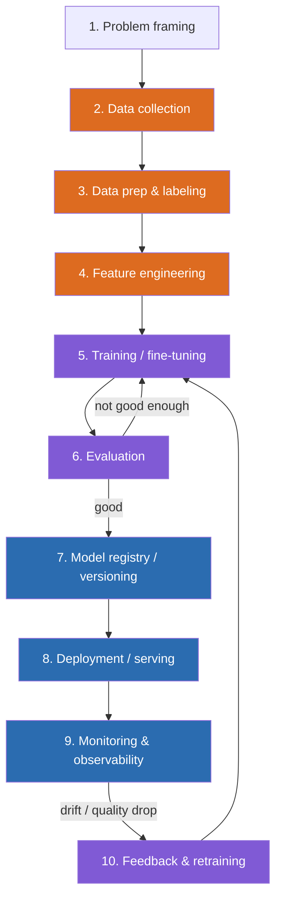
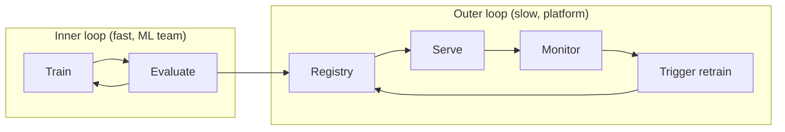

# Deep Dive: The ML Lifecycle & Where Infra Lives  `I`

You already run a software delivery lifecycle (code → build → test → deploy → operate). The ML lifecycle is analogous but has extra, unfamiliar stages centered on **data** and **models as data**. Knowing which stages you own prevents scope confusion with ML/research teams.

## The full lifecycle

Legend: **Blue** = platform/infra (you own it) · **Purple** = shared · **Orange** = data science / ML teams.

## Stage-by-stage, from an infra lens

| # | Stage | What happens | Your role |
|---|-------|-------------|-----------|
| 1 | Problem framing | Decide if ML is even the right tool | Advise on feasibility/cost |
| 2 | Data collection | Gather raw data | Provide storage, pipelines, governance |
| 3 | Data prep/labeling | Clean, label, split | Provide compute + labeling infra |
| 4 | Feature engineering | Derive model inputs | Feature stores, pipelines |
| 5 | Training/fine-tuning | Learn weights | **Provide GPU clusters, schedulers, checkpointing** |
| 6 | Evaluation | Measure quality | **Provide eval pipelines (Module 17)** |
| 7 | Model registry | Version + store models | **You own this (Module 18)** |
| 8 | Deployment/serving | Run the model for requests | **You own this (Modules 19, 23, 24)** |
| 9 | Monitoring | Watch health + quality + cost | **You own this (Module 29)** |
| 10 | Feedback/retraining | Improve with new data | Provide automation (Module 18) |

## The critical insight: two loops
There are two feedback loops with very different cadences.

- **Inner loop** = experimentation (ML team iterates on model quality). You provide the *platform* it runs on.
- **Outer loop** = production (register → serve → monitor → retrain). This is **your domain** and it maps almost 1:1 onto your existing CI/CD + GitOps + monitoring expertise — just with models and prompts as the artifacts.

## Mapping to what you already know

| Your DevOps concept | ML lifecycle analog |
|---------------------|---------------------|
| Artifact registry (ECR, Artifactory) | Model registry (MLflow) |
| CI pipeline | Training pipeline (Kubeflow/Airflow) |
| Automated tests | Evaluation suite |
| Canary / blue-green deploy | Canary / shadow model deploy |
| APM / metrics / logs | AI observability (traces, tokens, quality) |
| Rollback | Model/prompt rollback |
| Config management | Prompt + model config management |

## Key takeaways
- The **outer loop** (registry → serve → monitor → retrain) is where an AI infra engineer lives.
- Most of it maps onto existing DevOps muscle memory — with **models and prompts as first-class, versioned, testable artifacts**.
- Data stages exist and you *enable* them, but they're usually owned by ML/data teams.
