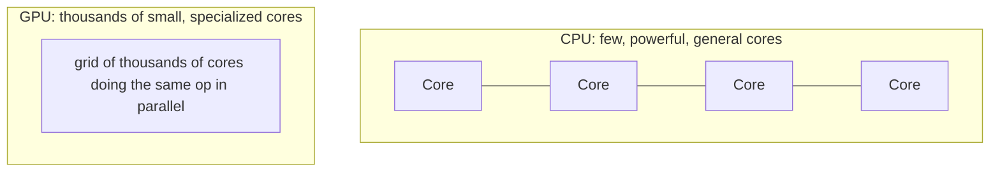
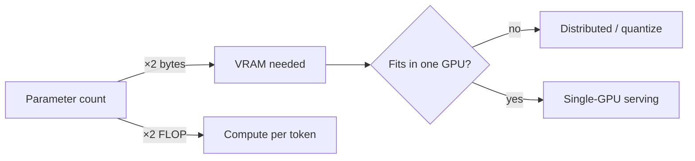

# Deep Dive: The AI Hardware Landscape  `I→A`

Why does AI live and die on GPUs? Why is a single H100 worth more than a car? This deep-dive builds the intuition you need before Modules 20 (GPU Infra) and 24–28 (serving).

## First principle: neural nets are matrix multiplies
A neural network layer computes `output = activation(input @ weights + bias)`. The `@` is a matrix multiplication. A large model does *billions* of these per token. So "AI compute" ≈ "matrix-multiply throughput" (measured in FLOPS — floating-point ops per second).

## Why CPUs are the wrong tool

- **CPU** cores are big and smart: great at branchy, sequential, latency-sensitive logic (running your OS, orchestrators, web servers). But only a handful of them → limited parallel math.
- **GPU** cores are small and numerous: thousands of them do the *same* arithmetic on different data simultaneously (SIMT). A matrix multiply is exactly this pattern → GPUs are 10–100× faster for it.

## The accelerator spectrum

| Type | Examples | Nature | Strengths | Weaknesses |
|------|----------|--------|-----------|------------|
| **CPU** | Intel Xeon, AMD EPYC, Graviton | General-purpose | Orchestration, data prep, small models | Slow DL math |
| **GPU** | NVIDIA H100/A100/L4/L40S, AMD MI300 | Massively parallel | Training + inference of DL/LLMs | Cost, scarcity, power, drivers |
| **TPU** | Google TPU v5e/v5p | Matrix-multiply ASIC | Huge-scale training/inference | GCP-only, XLA toolchain |
| **Custom inference ASIC** | AWS Inferentia, Google TPU, Groq, Cerebras | Purpose-built | Cost/perf for inference | Ecosystem maturity, portability |
| **AWS Trainium** | trn1/trn2 | Training ASIC | Cost-optimized training | Toolchain lock-in |

## GPU anatomy you must know (preview of Module 20)
- **VRAM (GPU memory):** the scarcest resource. Model weights + activations + KV cache must fit. An H100 has 80GB; a 70B model in FP16 needs ~140GB → *doesn't fit on one GPU* (why Module 28 exists).
- **Tensor Cores:** dedicated matrix-multiply units; using them (via FP16/BF16/FP8) is how you get real throughput.
- **Memory bandwidth:** often the real bottleneck for inference (moving weights, not computing). HBM bandwidth matters more than raw FLOPS for LLM decode.
- **Interconnect:** NVLink/NVSwitch (intra-node) and InfiniBand/RoCE (inter-node) let GPUs share data fast for distributed work.

## The two numbers that explain most decisions
1. **Model memory (FP16) ≈ 2 bytes × parameters.** A 7B model ≈ 14GB; 70B ≈ 140GB. Quantization (Module 06) shrinks this.
2. **Compute per token ≈ 2 × parameters FLOPs.** A 7B model ≈ 14 GFLOP/token. Multiply by tokens/sec to size hardware.

## Cost intuition
GPUs are billed by the hour. Order-of-magnitude on-demand cloud prices (varies wildly, always verify):
- Small inference GPU (L4/T4): ~$0.5–1/hr
- A100 80GB: ~$2–4/hr
- H100 80GB: ~$3–10/hr

At scale, a fleet of GPUs at low utilization is the #1 way to burn money — which is why *utilization* and *autoscaling* (Modules 21, 24, 31) dominate FinOps for AI.

## Why NVIDIA dominates (and why it matters to you)
CUDA — NVIDIA's software ecosystem — is the de facto standard; virtually all frameworks (PyTorch, vLLM, TensorRT-LLM) target it first. This means driver/CUDA/toolkit version management becomes an operational concern you will own (Module 20). Alternatives (AMD ROCm, TPU/XLA, Inferentia/Neuron) exist and matter for cost, but ecosystem gravity is with NVIDIA today.

## Key takeaways
- AI compute ≈ matrix-multiply throughput → GPUs win.
- **VRAM is the scarcest resource**; model size vs GPU memory drives most architecture decisions.
- Memorize: **~2 bytes/param (memory)** and **~2 FLOP/param/token (compute)**.
- GPU **utilization** is the master lever for cost.
