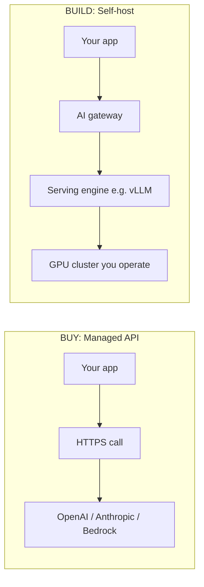
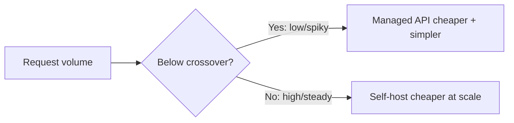
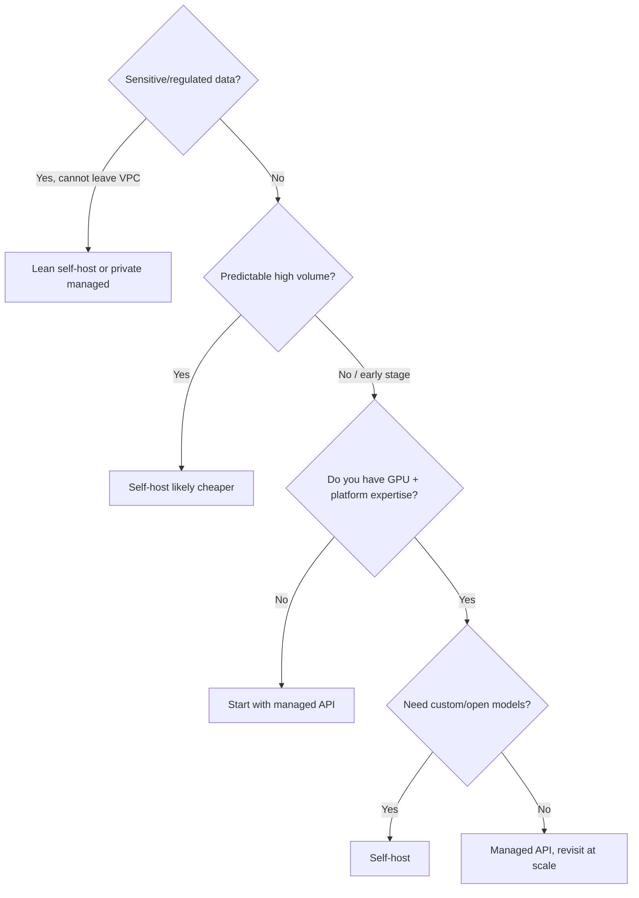

# Deep Dive: Build vs Buy (Self-Host vs Managed API)  `A`

The most consequential early decision on any AI system: **run models yourself on GPUs, or call a hosted API?** This recurs in nearly every module. Learn to reason about it now.

## The two ends of the spectrum

## Decision factors

| Factor | Managed API (buy) | Self-host (build) |
|--------|-------------------|-------------------|
| **Time to first value** | Minutes | Weeks–months |
| **Upfront cost** | ~$0 | High (GPUs, eng time) |
| **Marginal cost** | Per-token (can explode at scale) | GPU-hours (predictable, cheaper at high volume) |
| **Data privacy** | Data leaves your boundary | Data stays in your VPC |
| **Model choice** | Vendor's catalog | Any open model |
| **Customization** | Limited (some fine-tuning) | Full (any fine-tune, quantization) |
| **Latency control** | Vendor-controlled | You control + optimize |
| **Operational burden** | Vendor's problem | **Yours** (this handbook) |
| **Compliance/residency** | Vendor's certifications | You control fully |
| **Rate limits** | Vendor-imposed | Self-imposed |

## The cost crossover
Managed APIs win at low/uncertain volume; self-hosting wins past a break-even volume.

Rough mental model: managed APIs cost per-token; self-hosting cost is amortized GPU-hours. If your steady-state token volume keeps GPUs well-utilized, self-hosting is usually cheaper *and* private — but only if you can operate it (that's the catch this handbook removes).

## A decision framework

## Hybrid is the real answer at enterprise scale
Most mature AI platforms do **both**, hidden behind an **AI gateway** (Module 31) that routes:
- cheap/simple requests → small self-hosted model
- hard requests → large self-hosted or premium API
- overflow/burst → managed API as a spillover

This is *model routing* (Module 18) and it's a core platform capability. The gateway also gives you one place for auth, rate limiting, cost tracking, and observability regardless of backend.

## How this threads through the handbook
- **Buy path** deep-dived in Modules 33–36 (Cloud AI, Bedrock, Vertex, Azure).
- **Build path** is Modules 19–28 (serving + GPUs + distributed inference).
- **Hybrid/gateway/routing** is Modules 18 and 31.

## Key takeaways
- No universal answer — it's a function of **data sensitivity, volume, expertise, and customization needs**.
- Managed = fast + simple + per-token; self-host = private + cheaper-at-scale + operationally heavy.
- Mature platforms are **hybrid behind a gateway** — the endgame you'll build in the capstone.
