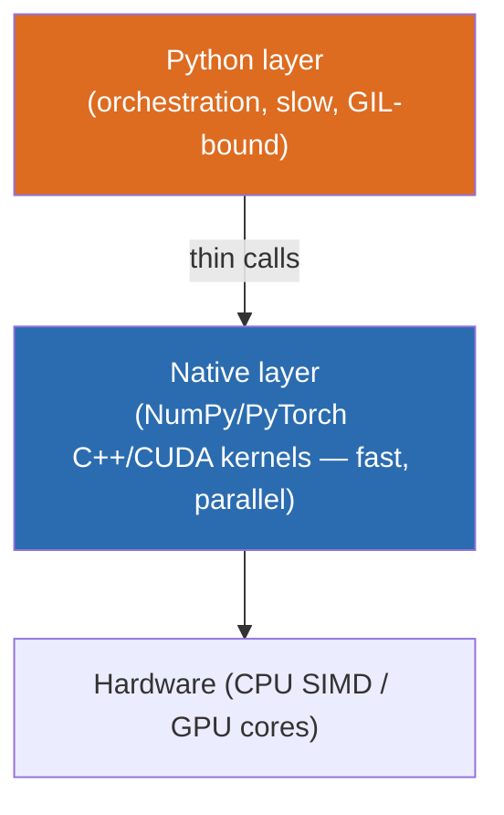
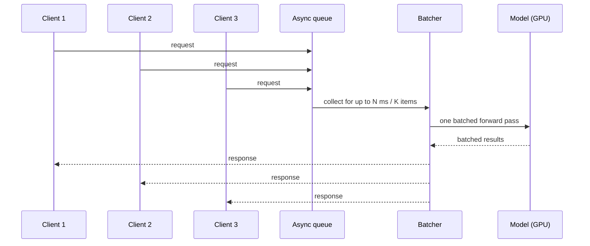
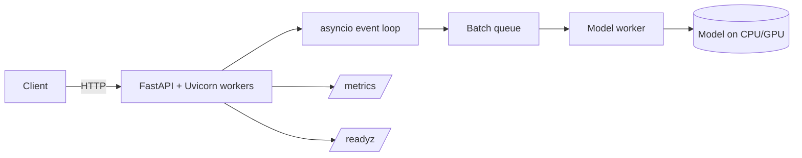

# 02 · Python for AI

**Track:** Foundations · **Difficulty band:** `B→I` · **Est. time:** 2–3 weeks

> You are not here to become a data scientist. You are here to become the engineer who makes *their* Python run reliably, fast, and cheaply in production. This module gives you the exact slice of the Python/AI toolchain an infrastructure engineer needs — tensors, async serving, batching, profiling, packaging, and GPU-aware code — and skips the modeling math (that's Modules 03–06).

---

## Learning Objectives
By the end you will be able to:
- **Manipulate tensors** with NumPy and PyTorch and explain the memory/dtype/device model that determines cost.
- **Build an async inference service** in FastAPI that doesn't block the event loop under load.
- **Implement dynamic request batching** — the single most important throughput pattern in model serving.
- **Profile** a Python inference path (CPU, memory, and time) and find the real bottleneck instead of guessing.
- **Produce reproducible environments and artifacts** with `uv`, lockfiles, and slim multi-stage Docker images.
- **Move data on/off the GPU correctly** and reason about why the wrong data movement kills performance.
- **Run notebooks responsibly** and know when they must become real code.

## Required Background
- **From this repo:** `01 AI Foundations` (training vs inference, the stack, VRAM/FLOP estimators).
- **DevOps skills leveraged:**
  - Your packaging/artifact instincts → Python deps become a supply-chain + reproducibility problem you already know how to reason about.
  - Your async/concurrency knowledge from other stacks → maps onto Python's `asyncio` and the GIL.
  - Your container expertise → slim, cached, multi-stage images for ML services.

---

## 1. Theory (WHY before HOW)

### 1.1 Why Python owns AI (and what that costs you)
Python is the *lingua franca* of AI because the heavy math lives in compiled C/C++/CUDA underneath (NumPy, PyTorch). Python is the thin, ergonomic orchestration layer. The catch for an infra engineer: **Python itself is slow and single-threaded (the GIL)**, so performance comes entirely from *keeping work inside the fast native layer and off the Python interpreter*. Almost every performance lesson in this module is a variation of that one idea.



> **WHY it matters:** a for-loop over a tensor in Python is 100× slower than one vectorized call, because the loop pays the interpreter tax per element while the vectorized call spends one trip into optimized native code. Full deep-dive: [`theory/01-python-toolchain.md`](./theory/01-python-toolchain.md).

### 1.2 Tensors: the universal data structure
Everything an AI system touches — inputs, weights, activations, outputs — is a **tensor** (an n-dimensional array). You must understand three properties because they drive memory and speed:

| Property | What it is | Why you care |
|----------|-----------|--------------|
| **shape** | dimensions, e.g. `(batch, seq, hidden)` | mismatched shapes = the #1 error class |
| **dtype** | number format (fp32/fp16/bf16/int8) | halving precision ~halves memory + speeds Tensor Cores |
| **device** | `cpu` / `cuda:0` | data must be on the same device as the compute |

Deep-dive with diagrams: [`theory/02-tensors-numpy-pytorch.md`](./theory/02-tensors-numpy-pytorch.md).

### 1.3 The serving concurrency model (the heart of this module)
An inference server has a cruel property: a single request underutilizes a GPU, but naive concurrency (one thread/process per request, each running the model) blows up memory. The resolution is **async I/O in front + batching at the compute boundary**.



> **WHY:** the GPU is happiest doing one big matrix multiply for many requests at once. Batching turns three underutilized passes into one efficient pass — higher throughput and better $/request, at the cost of a few ms of latency. This is exactly what vLLM/Triton automate later (Modules 24, 26); here you build a minimal version by hand so you *understand* it. Deep-dive: [`theory/03-async-serving-batching.md`](./theory/03-async-serving-batching.md).

### 1.4 Architecture: the shape of a Python inference service


### 1.5 Reproducibility & packaging
An ML service's behavior depends on exact versions of `torch`, CUDA, and dozens of transitive deps. Non-reproducible envs cause "works on my GPU" disasters. The fix is the same discipline you already apply to other artifacts: **lockfiles + pinned versions + immutable images**, with `uv` as the fast modern tool. Deep-dive: [`theory/04-packaging-envs.md`](./theory/04-packaging-envs.md).

### Trade-offs & Comparisons
| Choice | Options | When to pick which |
|--------|---------|--------------------|
| Env/deps manager | `uv` vs `poetry` vs `pip+venv` vs `conda` | `uv` for speed + lockfiles (default here); `conda` when you need non-Python/CUDA system libs |
| Web framework | FastAPI vs Flask | FastAPI for async + typed schemas (default for AI serving); Flask only for trivial sync tools |
| Numeric lib | NumPy vs PyTorch | NumPy for CPU data prep; PyTorch when you need autograd/GPU/models |
| Concurrency | async vs threads vs processes | async for I/O-bound glue; processes for CPU-bound parallelism (GIL); model workers isolate GPU memory |

### Failure Modes
- **Blocking the event loop:** running a synchronous model call directly in an `async def` handler freezes *all* concurrent requests. Offload to a worker/executor.
- **Device mismatch:** `input` on CPU, `model` on GPU → runtime error or silent slow `.cpu()` copies.
- **Dtype surprises:** mixing fp32 and fp16 tensors → errors or precision loss.
- **Dependency drift:** unpinned `torch`/CUDA → cannot reproduce or roll back.

---

## 2. Production Use Cases
1. **High-throughput embedding service:** async FastAPI + dynamic batching to embed thousands of docs/sec cost-effectively (foreshadows Module 08).
2. **Model gateway shim:** a thin async Python service that normalizes requests to multiple backends (foreshadows Module 31).
3. **Batch scoring job:** vectorized NumPy/pandas pipeline that scores millions of rows without Python loops.
4. **Notebook → service promotion:** turning a data scientist's prototype notebook into a tested, packaged, containerized service — a daily platform task.

## 3. Code Examples
```python
# Vectorization: never loop in Python over tensor elements.
import numpy as np

x = np.random.rand(1_000_000)
# BAD: Python loop pays the interpreter tax per element
# total = 0.0
# for v in x: total += v * 2
# GOOD: one native call
total = float((x * 2).sum())
```

```python
# Device + dtype discipline in PyTorch
import torch

device = "cuda" if torch.cuda.is_available() else "cpu"
model = torch.nn.Linear(512, 512).to(device).half()   # fp16 on GPU
x = torch.randn(8, 512, device=device, dtype=torch.float16)  # MATCH device+dtype
y = model(x)   # one batched forward pass over 8 items
```

## 4. Hands-On Labs
See [`labs/`](./labs/).

| Lab | Level | Objective |
|-----|-------|-----------|
| [02.1](./labs/02.1-tensors-and-profiling/) | `I` | Master tensors + prove vectorization/device effects with a profiler. |
| [02.2](./labs/02.2-async-batching-service/) | `I→A` | Build an async FastAPI service with hand-rolled dynamic batching; measure the throughput win. |
| [02.3](./labs/02.3-packaging-repro-env/) | `I` | Produce a reproducible, locked, slim-container ML service (`uv` + multi-stage Docker). |

## 5. Projects
- **Mini project:** [`projects/mini/`](./projects/mini/) — refactor a "notebook prototype" into a tested, typed, packaged inference module.
- **Large project:** [`projects/large/`](./projects/large/) — **Production Python Inference Microservice**: async + dynamic batching + metrics + profiling + reproducible image, evolved v1→production.

## 6. Design Review
See [`design-reviews/`](./design-reviews/): reference architecture for an async batched service + ADRs (env manager choice, batching vs per-request serving).

---

## 7. Performance Tuning
Levers, in order of impact: **(1) vectorize** (kill Python loops), **(2) batch** at the compute boundary, **(3) right dtype/device**, **(4) avoid needless CPU↔GPU copies**, **(5) don't block the event loop**. Always **profile first** (Lab 02.1 teaches `cProfile`, `torch.profiler`, and `memory_profiler`). Target intuition: a correct batch of 32 can be ~10–20× the throughput of one-at-a-time on a GPU.

## 8. Security Considerations
Python's supply chain is the threat surface: **pin and hash-lock dependencies**, scan for CVEs, avoid `pickle`/`torch.load` on untrusted files (use `safetensors`), and never `eval`/`exec` model or user input. Notebooks often hide secrets in output cells — strip them before commit.

## 9. Cost Optimization
Throughput per dollar is set here before you ever touch a serving engine: batching + vectorization + right-sizing dtype directly reduce GPU-hours per request. Slim images cut registry/egress cost and cold-start time.

## 10. Scaling Considerations
Async lets one process handle many concurrent I/O-bound requests; the GIL means CPU-bound work needs multiple *processes* (Uvicorn workers) or native parallelism. GPU model workers should be separate from the async web layer so you can scale them independently — the seed of the serving architectures in Modules 19–24.

---

## 11. Best Practices
See [`best-practices.md`](./best-practices.md).

## 12. Common Pitfalls
See [`common-pitfalls.md`](./common-pitfalls.md).

## 13. Troubleshooting
See [`troubleshooting.md`](./troubleshooting.md).

## 14. Checklists
See [`checklists.md`](./checklists.md).

---

## 15. Assessments
See [`assessments/`](./assessments/): self-assessment quiz, practical exam, architecture interview, troubleshooting interview, code review, scenario interview, system-design interview, production incident, and the module final exam.

---

## 16. Further Reading
See [`references/`](./references/README.md).

---

## Knowledge Graph Position
- **Requires:** `01 AI Foundations`.
- **Unlocks:** `03 ML Fundamentals`, `04 Deep Learning`, and every serving module (the async+batching pattern recurs in 19, 24).
- **Critical path?** **Yes.**
