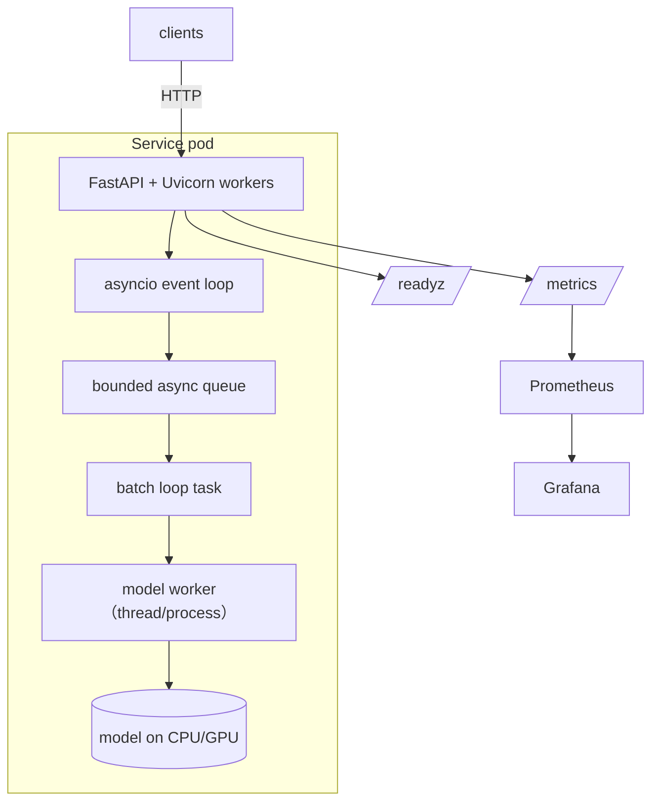

# Reference Architecture · Async Batched Python Inference Service

**Module:** 02 · **Difficulty:** `A`

The canonical single-service shape for CPU/GPU inference in Python. It cleanly separates the async web layer from the model compute layer so each scales independently — the seed of every serving architecture in Modules 19–28.

## Context
One team needs a fast, cost-efficient inference endpoint for a small/medium model. Concurrency is real (many overlapping requests). We must maximize throughput per dollar without OOM or event-loop stalls.

## Architecture

## Key decisions (see ADRs)
- **Env/dependency manager** → [ADR-0001](./adr/0001-dependency-manager.md).
- **Batching vs per-request serving** → [ADR-0002](./adr/0002-batching-vs-per-request.md).

## Component responsibilities
| Component | Responsibility | Later module |
|-----------|----------------|--------------|
| FastAPI async layer | Accept requests, validate, enqueue, await futures | 19 |
| Bounded queue | Backpressure + load shedding | 19, 31 |
| Batch loop | Assemble batches (size/delay dial), one forward pass | 24 |
| Model worker | Run compute off the event loop; isolate GPU memory | 22, 24 |
| Prometheus/Grafana | RED metrics + batch-size + saturation | 29 |

## Design principles
- **Never block the event loop** with compute (offload to worker/executor).
- **Separate web scaling from model scaling** (workers ≠ replicas of the model).
- **Bound the queue** — degrade with 503, never OOM.
- **Expose the latency↔throughput dial** (`max_batch`, `max_delay_ms`) as config, not code.

## What's intentionally missing (and where it's added)
| Missing | Why it matters | Added in |
|---------|----------------|----------|
| Continuous batching + KV cache | LLM efficiency | 24 |
| Autoscaling on GPU/queue metrics | cost + burst | 21, 23 |
| Multi-model / routing | platform | 18, 31 |
| Distributed multi-GPU | big models | 28 |
| AuthN/Z, rate limits | multi-tenant safety | 31 |

## Non-functional targets (baseline)
- Throughput: batched ≥ 3× per-request at target concurrency.
- Latency: documented p50/p95/p99; `max_delay_ms` tuned to SLO.
- Resilience: bounded queue + per-request timeout + graceful shutdown of the batch task.
- Observability: RED + batch-size histogram + inflight gauge.

## Review questions to defend
1. Where exactly does model compute run, and how do you *prove* the event loop isn't blocked?
2. How do you choose `max_batch` and `max_delay_ms` for an interactive vs a bulk workload?
3. What happens at 10× traffic — what breaks first, and what do you add?
4. Why separate the model worker from the web workers?
