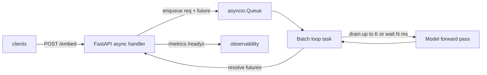

# Lab 02.2 · Async Service with Dynamic Batching  `I→A`

## Objective
Build, by hand, the pattern that serving engines industrialize: an async FastAPI service that collects concurrent requests into batches and runs one forward pass per batch. Then measure the throughput win vs per-request serving. This is the conceptual core of Modules 19 and 24.

## Architecture


## Prerequisites
- **Tools:** Python 3.11+, `uv`/pip, and `hey` (or `ab`) for load. Deps in [`requirements.txt`](./requirements.txt).
- **Infra:** CPU is fine. The "model" is a fixed matmul so results are deterministic and hardware-agnostic.
- **Prior labs:** 02.1.
- **Estimated cost:** free (local).
- **Estimated time:** 60–90 min.

## Implementation
```bash
uv venv && source .venv/bin/activate
uv pip install -r requirements.txt

# Batching ENABLED (default): max_batch=32, max_delay_ms=5
uvicorn app:app --host 0.0.0.0 --port 8000

# In another terminal, load test:
hey -n 2000 -c 50 -m POST -H 'content-type: application/json' \
  -d '{"text":"hello world"}' http://localhost:8000/embed
```
Then compare against **batching disabled** (per-request) to feel the difference:
```bash
BATCH_ENABLED=0 uvicorn app:app --port 8001
hey -n 2000 -c 50 -m POST -H 'content-type: application/json' \
  -d '{"text":"hello world"}' http://localhost:8001/embed
```

Endpoints:
- `POST /embed` — `{"text": "..."}` → a small fixed-size vector (a stand-in for a real embedding model).
- `GET /readyz`, `GET /metrics` — readiness + Prometheus metrics (incl. observed batch sizes).

## Validation
```bash
curl -s -X POST localhost:8000/embed -H 'content-type: application/json' \
  -d '{"text":"hello"}' | jq '.dim, .batch_size'
curl -s localhost:8000/metrics | grep batch_size
```

## Expected Output
Under concurrency, batching should raise throughput and the batch-size histogram should show batches > 1:
```
# batching ENABLED
Requests/sec: 1850.4     Latency p95: 41ms     avg batch size: ~28

# batching DISABLED (per-request)
Requests/sec:  520.1     Latency p95: 96ms     avg batch size: 1
```
Exact numbers vary; the *shape* (batching wins on throughput) is the lesson.

## Failure Scenarios
| Symptom | Likely cause | Fix |
|---------|--------------|-----|
| Throughput same with/without batching | Concurrency too low (`-c` small) | Raise `-c` so requests actually overlap |
| All latency, no throughput gain | `max_delay_ms` too high | Lower delay; balance the latency↔throughput dial |
| Event loop stalls / everything slow | Model run inline in the async handler | Ensure compute happens in the batch loop, not the handler (this lab does it right — study why) |
| `RuntimeError: Event loop is closed` on shutdown | Batch task not cancelled cleanly | Handled in lifespan; don't kill -9 |
| Memory grows under load | Unbounded queue | `MAX_QUEUE` env caps it; observe rejections |

## Debugging Guide
1. Hit `/readyz` — batch loop + model must be up.
2. Watch `/metrics` `inference_batch_size` histogram while load testing; if it's all `1`, requests aren't overlapping (increase concurrency or delay).
3. Compare p50/p95 and RPS between ports 8000 (batched) and 8001 (per-request).
4. Toy with `MAX_BATCH` and `MAX_DELAY_MS` env vars and re-measure — internalize the dial.

## Cleanup
```bash
# Ctrl-C both uvicorn processes
deactivate && rm -rf .venv
```

## Production Discussion
You just built naive (static) batching: it waits for a batch to finish before starting the next. Production LLM engines add **continuous batching** (vLLM, Module 24), where finished requests free their slot every token step, and **KV-cache reuse**. Your hand-rolled version also lacks: length bucketing, load shedding under overload, per-request timeouts/cancellation, and separate scaling of web vs model workers. Every one of those is a future module — but now you understand the primitive they build on.
