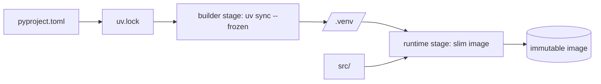

# Lab 02.3 · Reproducible, Locked, Slim-Container ML Service  `I`

## Objective
Package a small inference module the way production demands: declared deps, a committed lockfile, tests, and a slim multi-stage Docker image whose dependency layers cache independently of code changes. This turns "works on my machine" into "works identically everywhere".

## Architecture


## Prerequisites
- **Tools:** Python 3.11+, `uv` (`pip install uv` or the standalone installer), Docker.
- **Infra:** local.
- **Prior labs:** 02.1, 02.2.
- **Estimated cost:** free.
- **Estimated time:** 45–60 min.

## Implementation
```bash
# Step 1 — inspect the declared deps and lock them
cat pyproject.toml
uv lock                      # produces/updates uv.lock (commit this!)

# Step 2 — reproducible install + run tests in the locked env
uv sync --frozen
uv run pytest -q

# Step 3 — run the tiny service locally
uv run uvicorn src.service.app:app --port 8000
curl -s localhost:8000/healthz

# Step 4 — build the slim multi-stage image and run it
docker build -t repro-svc:0.1 .
docker run --rm -p 8000:8000 repro-svc:0.1
docker images repro-svc:0.1   # note the size
```

## Validation
```bash
# The lockfile exists and is used
test -f uv.lock && echo "locked"
# Tests pass
uv run pytest -q
# Container serves
curl -s localhost:8000/healthz
# Rebuild after a CODE-only change should reuse cached dependency layers
touch src/service/app.py && docker build -t repro-svc:0.1 .   # deps layer: CACHED
```

## Expected Output
- `uv.lock` present and committed.
- `pytest` green.
- Final image noticeably smaller than a naive single-stage build (no build tools).
- On a code-only change, the `uv sync` layer shows `CACHED` — dependency install is skipped.

## Failure Scenarios
| Symptom | Likely cause | Fix |
|---------|--------------|-----|
| `uv sync --frozen` fails | lockfile out of date with `pyproject.toml` | run `uv lock` and commit |
| Dependency layer rebuilds on every code change | `COPY src` placed before dep install | copy lockfiles + install FIRST, then copy source |
| Image very large | single-stage build, build tools included | use the multi-stage `Dockerfile` here |
| `ModuleNotFoundError` in container | venv not on PATH | ensure `ENV PATH=/app/.venv/bin:$PATH` (already set) |

## Debugging Guide
1. `uv sync --frozen` locally must succeed before Docker will.
2. Use `docker build --progress=plain` to see which layers are `CACHED`.
3. If deps rebuild constantly, your `COPY`/`RUN` ordering breaks caching — lockfiles before source.
4. `docker run --rm repro-svc:0.1 python -c "import torch; print(torch.__version__)"` to verify the locked torch is present.

## Cleanup
```bash
docker rmi repro-svc:0.1 || true
rm -rf .venv
```

## Production Discussion
This is the reproducibility baseline every ML service in this handbook assumes. In production you'd extend it with: hash-pinned locks + CVE scanning (Module 30), an NVIDIA CUDA base image with a pinned torch cu-build for GPUs (Module 20), pulling large model weights from a registry at deploy instead of baking them (Module 18), and image signing/provenance (supply-chain security). The layer-caching discipline you practiced here is what keeps CI fast and image builds cheap at scale.
