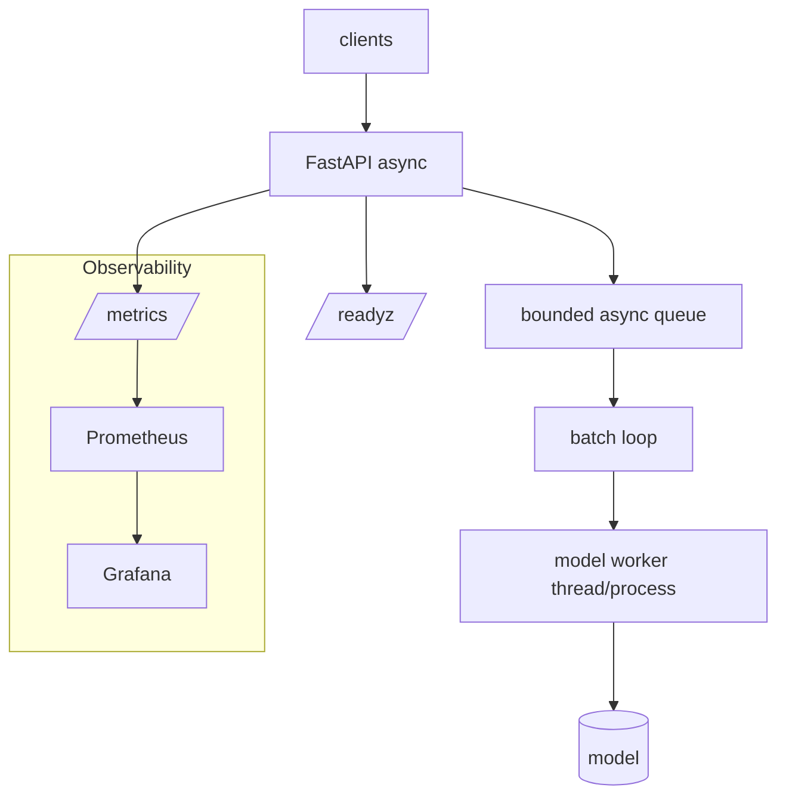

# Large Project · Production Python Inference Microservice

**Module:** 02 · **Type:** large · **Difficulty:** `I→A`

## Problem Statement
Build the reference **Python inference microservice** you'll reuse and re-skin for the rest of the handbook: async, dynamically batched, observable, profiled, reproducible, and containerized. It combines everything from all three labs into one production-shaped artifact.

## Requirements
- **Functional:** `POST /predict` (single) and `POST /predict/batch`; `/healthz`, `/readyz`, `/metrics`.
- **Non-functional (SLOs for this exercise, laptop CPU):**
  - ≥ 3× throughput with batching enabled vs disabled at 50 concurrent.
  - p95 latency documented at 3 concurrency levels.
  - Reproducible build; slim image; dependency layers cache on code-only changes.
  - No event-loop blocking (verified under load).

## Architecture

## Version Roadmap
| Version | Scope | New capabilities |
|---------|-------|------------------|
| **v1** | MVP | Async service + single `/predict` (from Lab 02.2 base). |
| **v2** | Batched | Dynamic batching with tunable `MAX_BATCH`/`MAX_DELAY_MS`; batch-size metrics. |
| **v3** | Observed + profiled | Full RED metrics + Grafana; a profiling report identifying the top bottleneck. |
| **Enterprise** | Hardened | Load shedding (bounded queue + 503), per-request timeout/cancellation, config schema, structured logs. |
| **Production** | Reproducible ship | Multi-stage image, lockfile, healthchecks, load-test report vs SLOs, runbook + teardown. |

## Implementation Guide
1. Start from Lab 02.2's `app.py`; make batching tunable and metered.
2. Add `/predict/batch` that accepts N inputs and returns N results.
3. Wire Prometheus + a `docker-compose.yml` with Grafana; build 3 panels (RPS, p95 latency, batch-size histogram).
4. Profile with `torch.profiler`/`cProfile`; write `PERF.md` naming the bottleneck and your fix.
5. Add load shedding, timeouts, structured logging, config validation.
6. Package with `uv` + multi-stage Dockerfile (Lab 02.3 pattern); run the load test and record results vs SLOs.

## Validation & Acceptance
- [ ] Batching gives ≥ 3× throughput at 50 concurrent (show the numbers).
- [ ] p95 documented at c=1/10/50.
- [ ] Overload returns 503 (not OOM); queue is bounded.
- [ ] Per-request timeout + cancellation work.
- [ ] Metrics + Grafana dashboard present.
- [ ] `PERF.md` identifies + fixes a real bottleneck.
- [ ] Reproducible slim image; dep layer caches on code-only change.
- [ ] Runbook + teardown documented.

## Deliverables
Service code, tests, `pyproject.toml` + `uv.lock`, `Dockerfile`, `docker-compose.yml`, Grafana dashboard JSON, `PERF.md`, `LOADTEST.md`, and a `RUNBOOK.md`.

## Extension Ideas
- Add continuous-batching semantics (free a slot as soon as an item finishes) → preview of vLLM (Module 24).
- Add length bucketing to avoid straggler-dominated batches.
- Split the model worker into a separate process and communicate over a queue → preview of decoupled serving (Modules 19, 22).
- Swap the stand-in model for a real embedding model and re-measure.
