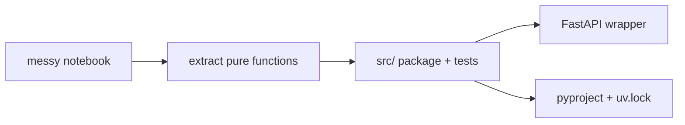

# Mini Project · Notebook → Production Module

**Module:** 02 · **Type:** mini · **Difficulty:** `I`

## Problem Statement
A data scientist hands you a Jupyter notebook that "works" and asks you to make it a real, importable, tested Python package the platform can deploy. This is one of the most common day-1 tasks for an AI infra engineer. You'll perform the **notebook → production** promotion.

## Requirements
- **Functional:** extract the notebook's logic into an importable package with a clean function API and a thin FastAPI wrapper.
- **Non-functional:**
  - Deterministic, unit-tested pure functions (no hidden global state).
  - No secrets or absolute paths; config via env.
  - Reproducible env (`pyproject.toml` + `uv.lock`).
  - Vectorized hot paths (no Python loops over arrays).

## Architecture

## Version Roadmap
| Version | Scope | New capabilities |
|---------|-------|------------------|
| **v1** | Extraction | Pure functions extracted from the notebook; a smoke test. |
| **v2** | Hardened | Typed API (pydantic), input validation, unit tests, removed global state, config via env. |
| **v3** | Packaged | `pyproject.toml` + lockfile; runnable via `uv run`; README with run/teardown. |

## Implementation Guide
1. Take any small notebook (write a 20-line one if needed: load data → transform → produce a number/vector).
2. **v1:** move logic into `src/<pkg>/core.py` as pure functions; delete cell-order dependencies.
3. **v2:** wrap with FastAPI, add pydantic request/response models, write `pytest` tests (determinism + validation), replace loops with vectorized NumPy.
4. **v3:** author `pyproject.toml`, `uv lock`, document `uv sync && uv run pytest`.

## Validation & Acceptance
- [ ] Logic importable as a module (not `.ipynb`).
- [ ] Pure functions are deterministic + unit-tested.
- [ ] No secrets/absolute paths; config via env.
- [ ] Hot path vectorized (show a before/after timing note).
- [ ] Reproducible: `uv sync --frozen && uv run pytest` is green.

## Deliverables
The package, tests, `pyproject.toml`, `uv.lock`, and a short `PROMOTION.md` describing what you changed and why (the "notebook smells" you removed).

## Extension Ideas
- Add a `Makefile`/`justfile` with `test`, `run`, `lock` targets.
- Add pre-commit hooks that strip notebook outputs and block secrets.
