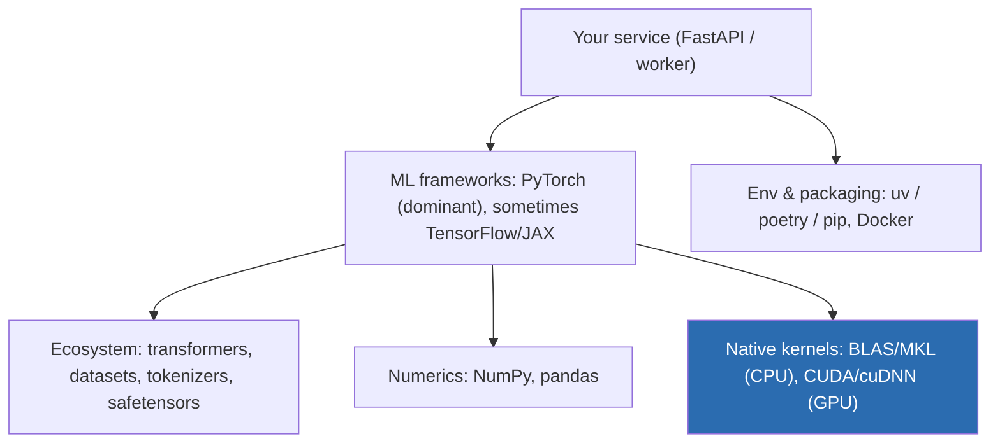
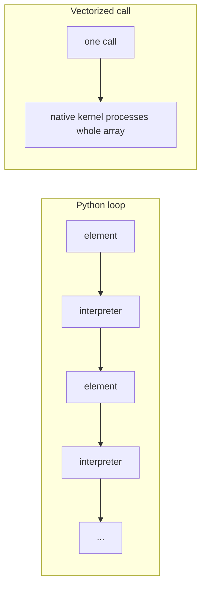
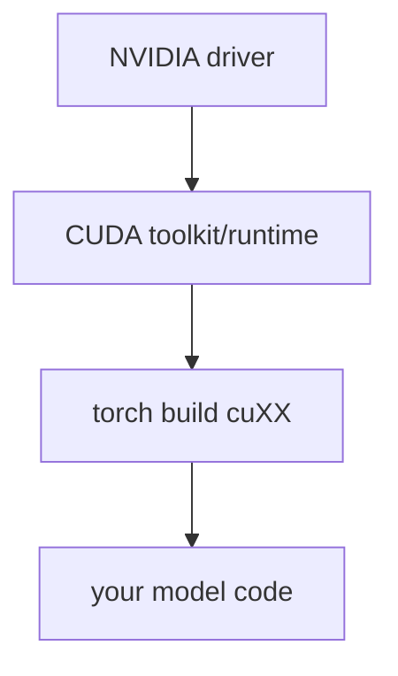

# Deep Dive: The Python/AI Toolchain (for infra engineers)  `B→I`

You don't need to write models. You need to *operate* the machine that runs them. This is the map of that machine.

## The layered toolchain

| Layer | Tool(s) | Your concern |
|-------|---------|--------------|
| Service | FastAPI, Uvicorn | async, batching, health, metrics |
| Framework | **PyTorch** | device/dtype, model loading, inference mode |
| Ecosystem | `transformers`, `safetensors`, `tokenizers` | model formats, tokenization cost |
| Numerics | NumPy, pandas | vectorized data prep, no Python loops |
| Native | CUDA/cuDNN, MKL | version compatibility (the pain point) |
| Packaging | `uv`, Docker | reproducibility, slim images |

## The one idea that explains all performance: push work into the native layer
Python executes bytecode one instruction at a time through the interpreter, holding the **GIL** (Global Interpreter Lock) so only one thread runs Python at once. Native libraries release the GIL and run optimized, vectorized, multi-threaded (or GPU) code.

**Rule:** the moment you write `for` over array elements, you've left the fast path. Express the operation as a whole-array (vectorized) call instead.

## Why PyTorch, not TensorFlow/JAX
- **PyTorch** dominates research and most inference tooling; vLLM, TensorRT-LLM wrappers, `transformers`, and KServe examples target it first. Default here.
- **TensorFlow** still appears in older production stacks and some Google contexts.
- **JAX** is powerful for research/TPUs; you'll see it around Google/DeepMind and some training stacks.

As an infra engineer you standardize on PyTorch but must recognize the others when they show up.

## The CUDA compatibility matrix (the thing that will bite you)
A GPU stack must align across four layers:

- The **torch wheel** is compiled against a specific CUDA version (`cu118`, `cu121`, ...).
- The **driver** must be new enough for that CUDA runtime.
- Mismatch → `torch.cuda.is_available() == False`, or cryptic kernel errors.
- **Mitigation:** pin the torch build, use NVIDIA's CUDA base images, and treat this as version-locked infrastructure (Module 20 goes deep).

## Notebooks: useful, dangerous
Jupyter notebooks are where ML prototypes are born. They're great for exploration and terrible for production because of hidden state (out-of-order execution), no tests, no packaging, and secrets leaking into output cells.

**Your job:** provide notebooks for exploration, but define a clear **promotion path** to real code (the mini project). Rules: strip outputs before commit, no secrets in cells, and anything that runs in production must be importable, tested, packaged modules — not `.ipynb`.

## Key takeaways
- The stack is a thin Python layer over fast native kernels; **keep work in the native layer**.
- Standardize on **PyTorch**; recognize TF/JAX.
- The **driver→CUDA→torch** version chain is real infrastructure — pin it.
- Notebooks are for exploration; production needs packaged, tested code.
