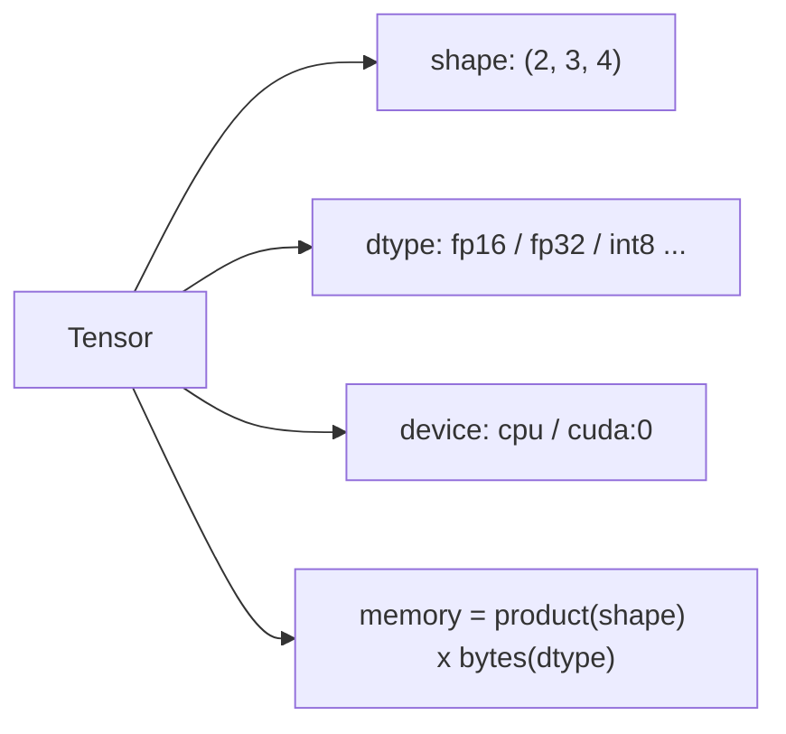
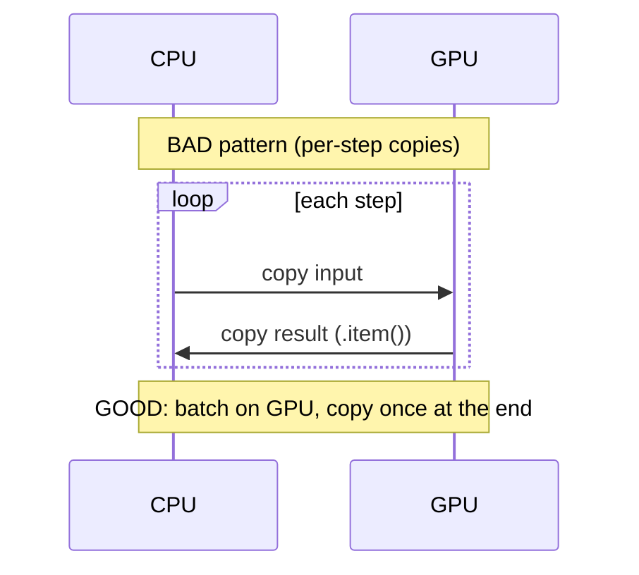

# Deep Dive: Tensors, NumPy & PyTorch  `I`

A tensor is just an n-dimensional array with a **shape**, a **dtype**, and a **device**. Master those three and most AI data errors and cost surprises become obvious.

## The mental model



- **0-D** = scalar, **1-D** = vector, **2-D** = matrix, **3-D+** = tensor.
- A batch of token embeddings might be shape `(batch, seq_len, hidden)` e.g. `(32, 512, 4096)`.

## Memory math you must be able to do in your head
`memory = num_elements × bytes_per_element`

| dtype | bytes | note |
|-------|-------|------|
| fp32 | 4 | default in NumPy; wasteful for inference |
| fp16 / bf16 | 2 | standard for GPU inference; bf16 has wider range |
| int8 | 1 | quantized inference |
| int4 | 0.5 | aggressive quantization |

Example: `(32, 512, 4096)` fp16 = 32·512·4096·2 bytes ≈ **134 MB** for *one* activation tensor. This is why batch size and sequence length dominate GPU memory (and why Module 24's KV cache math matters).

## NumPy vs PyTorch — when to use which
| | NumPy | PyTorch |
|--|-------|---------|
| Device | CPU only | CPU + GPU |
| Autograd | No | Yes (gradients) |
| Use for | data prep, batch analytics, glue | models, inference, GPU work |
| Interop | `torch.from_numpy(a)` / `t.numpy()` | zero-copy on CPU |

Rule of thumb: **NumPy/pandas for preparing data on CPU; PyTorch the moment a model or a GPU is involved.**

## Vectorization: the performance non-negotiable
```python
import numpy as np
a = np.arange(1_000_000, dtype=np.float32)

# Slow: Python loop (interpreter tax per element)
# out = np.empty_like(a)
# for i in range(len(a)): out[i] = a[i] * 2 + 1

# Fast: one vectorized native call
out = a * 2 + 1
```
The vectorized form is typically 50–200× faster and is the *only* acceptable style in hot paths. **Broadcasting** lets differently-shaped tensors combine without explicit loops — learn its rules; they prevent both bugs and slow code.

## Device & dtype discipline (the two most common runtime errors)
```python
import torch
device = "cuda" if torch.cuda.is_available() else "cpu"

model = torch.nn.Linear(4096, 4096).to(device).half()  # fp16 on device
x = torch.randn(32, 4096)                                # created on CPU, fp32!
# x @ model -> ERROR: expected device+dtype to match
x = x.to(device=device, dtype=torch.float16)             # fix: move + cast once
with torch.inference_mode():                             # disables autograd -> faster, less memory
    y = model(x)
```

Two rules:
1. **Match device and dtype** of inputs to the model. Do the conversion once, early — not per element.
2. **Use `torch.inference_mode()`** (or `no_grad()`) for inference: it skips gradient bookkeeping, saving memory and time.

## The CPU↔GPU transfer trap
Copying tensors across the PCIe bus is slow. A common performance bug is accidentally moving data back and forth (e.g. calling `.cpu()` or `.item()` inside a loop, or logging tensor values each step).



Keep data resident on the GPU; transfer in bulk at the boundaries only.

## Key takeaways
- Every tensor = **shape + dtype + device**; memory = elements × dtype-bytes.
- **Vectorize**; never loop over elements in Python.
- **Match device+dtype**, use `inference_mode()`, and avoid per-step CPU↔GPU copies.
- Batch/seq/hidden dimensions drive memory — the foundation for serving-engine tuning later.
