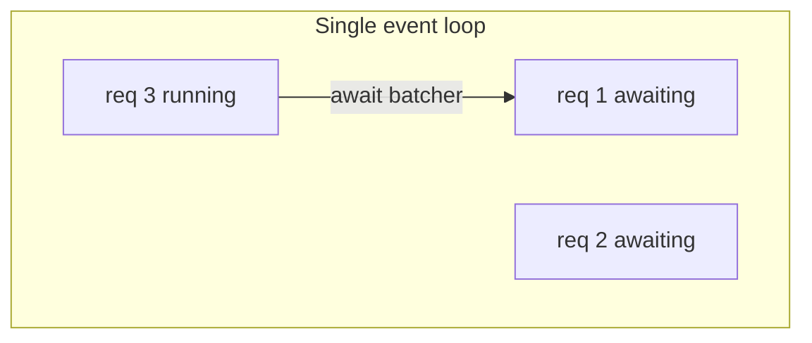
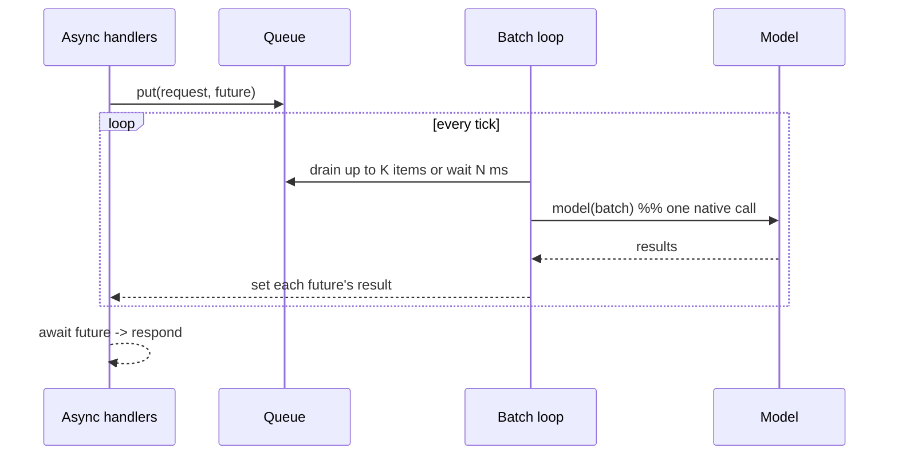
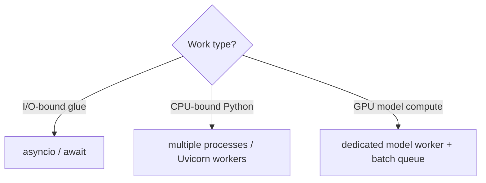

# Deep Dive: Async Serving & Dynamic Batching  `A`

This is the most important pattern in the module and one of the most important in the whole handbook. Serving engines like vLLM and Triton exist largely to do this well; building a minimal version by hand makes you understand what they buy you.

## The problem
- A GPU has thousands of cores. **One request** uses a sliver of them → terrible utilization → terrible $/request.
- **Naive concurrency** (spawn a model call per request) either serializes on the GIL or duplicates the model in memory → OOM.
- We want: many concurrent clients, one efficient batched compute step, bounded latency.

## The two-part solution

### Part 1 — async I/O for the web layer
Inference request handling is mostly *waiting* (network, queueing). `asyncio` lets one process juggle thousands of in-flight requests on a single thread by yielding while waiting — no thread-per-request explosion.

**The cardinal sin:** doing CPU/GPU-bound work directly in an `async def` handler. That blocks the *entire* loop — every concurrent request stalls. Model compute must be handed to a worker (thread/process/queue), not run inline.

### Part 2 — dynamic batching at the compute boundary
A background task collects incoming requests into a batch, waiting up to `max_delay_ms` OR until `max_batch_size` items accumulate, then runs **one** forward pass and fans results back.

The knobs and their trade-offs:

| Knob | Increase → | Decrease → |
|------|-----------|------------|
| `max_batch_size` | higher throughput, higher latency + memory | lower latency, worse utilization |
| `max_delay_ms` | fuller batches (throughput) | snappier responses (latency) |

This is the **latency ↔ throughput dial**. Interactive chat wants small delay; bulk embedding wants large batches.

## Why this is the seed of vLLM/Triton
Naive batching waits for the *whole* batch to finish before starting new work. Production engines add:
- **Continuous batching** (vLLM): add/remove requests from the batch every token step, so a finished request frees its slot immediately (Module 24).
- **Padding-free / bucketing**: avoid wasting compute on padded tokens.
- **KV-cache management**: reuse attention state across steps.

You'll build the *simple* version here; recognize the advanced version later.

## Concurrency model cheat-sheet

- **async** for network/glue.
- **processes** (not threads) for CPU-bound parallelism, because the GIL serializes threads.
- **a dedicated model worker** so the web layer and the GPU scale independently.

## Failure modes to design against
- **Loop starvation:** any sync/blocking call in the loop freezes everything → use `run_in_executor` or a separate worker.
- **Unbounded queue:** traffic spikes → memory blowup → OOM. Bound the queue and shed/So-reject load.
- **Batch stragglers:** one huge input in a batch slows all → cap per-item size; consider length bucketing.
- **Timeouts:** a stuck model holds futures forever → per-request timeouts + cancellation.

## Key takeaways
- **async in front, batching at the compute boundary** = the core serving pattern.
- Never block the event loop with model compute.
- `max_batch_size` and `max_delay_ms` are your latency↔throughput dial.
- This hand-built pattern is what vLLM/Triton industrialize (continuous batching, KV cache) in later modules.
