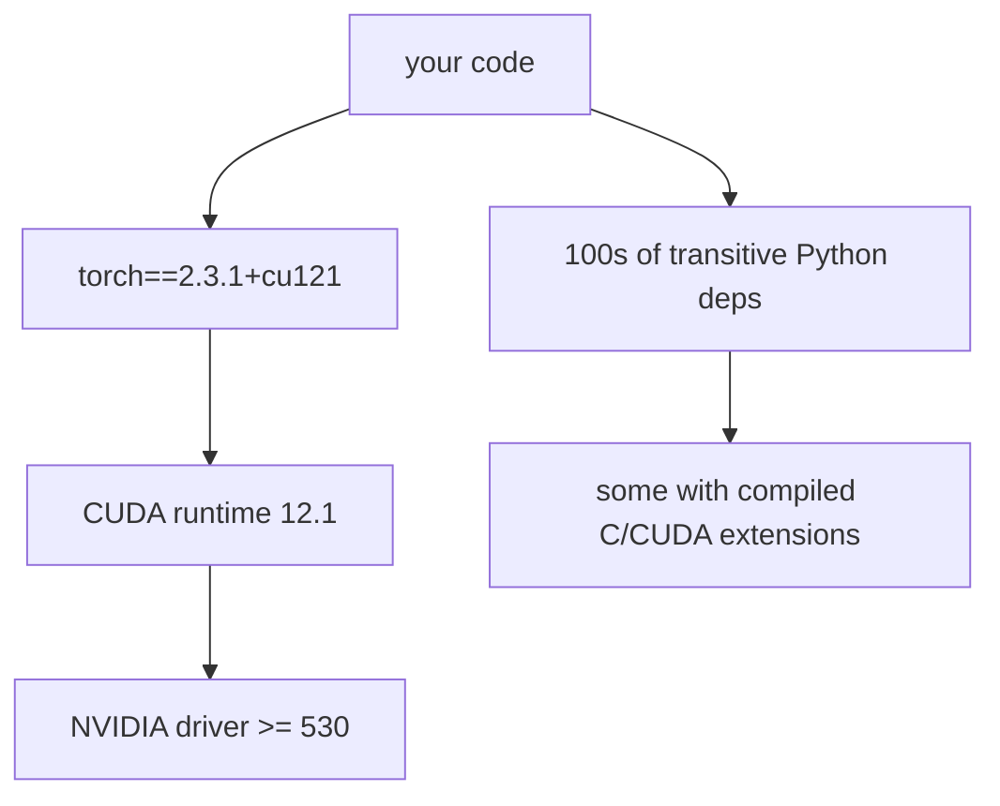

# Deep Dive: Packaging & Reproducible Environments  `I`

"Works on my GPU" is the ML version of "works on my machine" — and it's worse, because the CUDA/torch stack is fragile. Reproducibility is an infrastructure requirement, not a nicety.

## What makes ML envs uniquely painful

Two hard problems stacked: a huge transitive Python dependency tree **and** a native driver/CUDA chain outside `pip`'s control.

## The discipline (same instincts as your other artifacts)
1. **Declare** top-level deps with exact intent (`pyproject.toml`).
2. **Lock** the full resolved tree with hashes (`uv.lock` / `poetry.lock` / `requirements.txt` with `--generate-hashes`).
3. **Pin** the torch build to a CUDA version explicitly.
4. **Bake** into an immutable image built on an NVIDIA CUDA base.
5. **Never** mutate a running environment; rebuild the image.

## Tool comparison
| Tool | Strengths | Weaknesses | Use when |
|------|-----------|-----------|----------|
| **uv** | Extremely fast, lockfile, pip-compatible, single binary | Newer | Default for this handbook |
| poetry | Mature, good UX, lockfile | Slower resolves | Existing poetry projects |
| pip + venv + pip-tools | Ubiquitous, simple | Manual locking | Minimal setups / CI base |
| conda / mamba | Handles non-Python + CUDA system libs | Heavy, slow, large images | Need system-level scientific libs |

## uv workflow (default)
```bash
uv init                       # create pyproject.toml
uv add torch==2.3.1 fastapi   # add + resolve + lock
uv sync                       # install exactly from uv.lock (reproducible)
uv run pytest                 # run in the locked env
```
The `uv.lock` is your reproducibility guarantee — commit it.

## Multi-stage Docker for ML services
Goal: small, cached, no build tools in the final image, model baked in.

```dockerfile
# ---- builder ----
FROM python:3.11-slim AS builder
RUN pip install uv
WORKDIR /app
COPY pyproject.toml uv.lock ./
RUN uv sync --frozen --no-dev            # install into a venv, cached by lockfile

# ---- runtime ----
FROM python:3.11-slim
WORKDIR /app
COPY --from=builder /app/.venv /app/.venv
ENV PATH="/app/.venv/bin:$PATH"
COPY src/ ./src/
CMD ["uvicorn", "src.app:app", "--host", "0.0.0.0", "--port", "8000"]
```

For GPU images, swap the base for `nvidia/cuda:12.1.1-runtime-ubuntu22.04` and install a matching torch cu121 wheel. Layer ordering matters: copy lockfiles and install *before* copying source, so dependency layers cache across code changes.

## Image size levers
- Use `-slim` (or distroless) bases.
- Multi-stage: keep compilers/build deps out of the final image.
- `--no-cache-dir`, clean apt lists.
- Bake model weights only if small; otherwise pull from a model registry/volume at deploy (Module 18) — a real trade-off between image size and cold-start.

## Reproducibility checklist
- [ ] `pyproject.toml` + committed lockfile.
- [ ] torch pinned to an explicit CUDA build.
- [ ] Image built on a pinned base; digest recorded.
- [ ] No runtime `pip install`.
- [ ] Deterministic model source + version + checksum.

## Key takeaways
- ML reproducibility = **lockfiles + pinned torch/CUDA + immutable images**.
- Prefer **uv** for speed and lockfiles; conda only for system-lib needs.
- **Multi-stage Docker** with lockfile-first layer ordering = small, cacheable images.
- Treat the driver→CUDA→torch chain as version-locked infrastructure.
