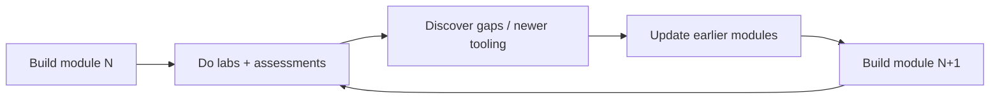

# Contributing & Authoring Guide

This repository is a **living engineering handbook**. This guide defines how each module is authored, structured, and continuously improved so quality stays uniform across all 40 modules.

---

## Build Model: Iterative Phases

- **Phase 1 — Architecture & Roadmap:** the `/00-roadmap` control center + this guide (done).
- **Phase 2 — Modules:** built **one module at a time**, in dependency order. A module is not "done" until it passes the Definition of Done below. Earlier modules are revisited and improved as later ones reveal gaps.

Build order follows the [knowledge graph](./00-roadmap/knowledge-graph.md) critical path, starting at `01-ai-foundations`.

---

## Canonical Module Layout

Every `NN-module-name/` folder MUST contain:

```
NN-module-name/
├── README.md                 # follows templates/module-template.md
├── theory/                   # deep-dives + diagrams
├── labs/
│   └── NN.X-name/README.md   # follows templates/lab-template.md
├── projects/
│   ├── mini/README.md        # follows templates/project-template.md
│   └── large/README.md
├── design-reviews/
│   ├── reference-architecture.md
│   └── adr/NNNN-*.md         # follows templates/adr-template.md
├── assessments/              # follows templates/assessment-template.md
├── references/README.md      # papers, repos, books, videos, blogs, RFCs, benchmarks
├── best-practices.md
├── common-pitfalls.md
├── troubleshooting.md
└── checklists.md
```

Templates live in [`/00-roadmap/templates/`](./00-roadmap/templates/).

---

## Definition of Done (per module)

A module is complete only when all are true:

- [ ] `README.md` covers all 16 sections of the module template.
- [ ] Learning objectives are measurable (verb-first).
- [ ] Theory explains **WHY before HOW** and leverages existing DevOps expertise.
- [ ] ≥ 3 hands-on labs, each with full template sections incl. **validation + cleanup**.
- [ ] 1 mini project + 1 large project, with a **version roadmap**.
- [ ] ≥ 1 reference architecture + ≥ 2 ADRs.
- [ ] All 7 assessment types + quiz + final exam present.
- [ ] Troubleshooting, best-practices, common-pitfalls, checklists filled.
- [ ] Performance, security, cost, and scaling sections are concrete (with metrics/targets).
- [ ] References categorized and real (papers/repos/books/videos/blogs/RFCs/benchmarks).
- [ ] Every architecture/flow/network/cluster concept has a **Mermaid diagram**.
- [ ] Difficulty tags applied throughout (`B/I/A/E/S/P`).
- [ ] `00-roadmap/progress.md` updated to ✅ for the module.

---

## Authoring Standards

- **Diagrams:** Mermaid only (flowchart, sequence, infra, architecture, data-flow, network, cluster). No external image dependencies.
- **Code:** runnable, imports at top, pinned dependency versions. Prefer `uv`/poetry for Python, Helm/Kustomize for K8s, Terraform for cloud.
- **Labs:** reproducible from scratch; always include cost estimate + mandatory cleanup.
- **Comparisons:** whenever ≥ 2 tools solve a problem, include a comparison table + "when to choose which".
- **Trade-offs & failure modes:** every design section names them explicitly.
- **Real-world grounding:** reference how companies (OpenAI/Anthropic/NVIDIA/Meta/etc.) actually solve the problem, at a pattern level.
- **No hand-waving:** no references to non-existent tools/flags; verify commands and APIs.

---

## Continuous Improvement Loop



When a later module exposes a gap in an earlier one (new technique, better tool, changed API), update the earlier module and note it in `progress.md`.

---

## Style

Follow the root README's Markdown conventions: headings for sections, bold list titles, backticked file/tool names, Mermaid for diagrams, tables for comparisons.
